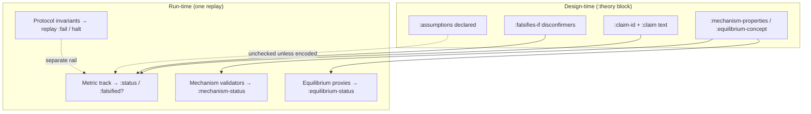

# CDRS v1.1 Theory Schema Documentation

## Overview

   The `:theory` block in CDRS v1.1 scenarios expresses a falsifiable claim about the protocol and specifies conditions that would refute it.

**Schema version:** 1.1  
**Evaluator:** `resolver-sim.scenario.theory/evaluate-theory`  
**Validator:** `resolver-sim.contract-model.replay/validate-scenario`  

If you are reading theory results for the first time, read:
1. Falsifiability glossary
2. Theory result contract
3. Claim terminology boundaries
4. Evaluation profiles

---

## Field Inventory

### Mandatory Fields (Parsed & Evaluated)

These fields are required when a `:theory` block is present. All are parsed and actively used by the evaluator.

#### `:claim-id` → keyword

Unique identifier for this claim.

- **Type:** keyword
- **Required:** yes (when `:theory` present)
- **Example:** `:claims/collusion-negative-ev`
- **Evaluation:** Included in evidence output; used as claim identifier in results

#### `:assumptions` → vector of keywords

Vector of assumption identifiers that this claim depends on.

- **Type:** `[keyword ...]` (may be empty `[]`)
- **Required:** yes (when `:theory` present)
- **Example:** `[:slashing-enforced :fraud-detection-rate-at-least-0.25 :positive-identity-reset-cost]`
- **Evaluation:** Recorded in output; not programmatically enforced (used for documentation and future constraint checking)
- **Design:** Assumptions make the scope of the claim explicit — if any assumption is violated, the claim's failure may not refute the protocol design.
- **Interpretation:** `:assumption-status :unchecked` means assumptions were declared but not verified against telemetry. They constrain how you read the result; they are not automatically true unless the scenario encodes them as predicates, invariants, or mechanism/equilibrium validators.

#### `:falsifies-if` → vector of metric conditions or structured predicate

Declares observable conditions that, if satisfied by the replay trace, **contradict**
the theory claim (falsification evidence, not validation).

- **Type:** `[{:metric kw :op kw :value num} ...]` **or** a structured predicate map
(`:and`, `:or`, `:not`, `:always`, `:state`, etc.)
- **Required:** yes when `:theory` is present **unless** a mechanism-only block is
  explicitly allowed (see below)
- **Mechanism-only empty `:falsifies-if`:** allowed for `:purpose` regression,
  `:adversarial-robustness`, and similar when `:mechanism-properties` and/or
  `:equilibrium-concept` are declared — metric track is `:not-applicable`
- **`:purpose :theory-falsification`:** **always** requires non-empty `:falsifies-if`
  (at least one direct metric disconfirmer). Proxy validators alone are not enough
  for negative-test scenarios; see [Purpose: theory-falsification](#purpose-theory-falsification)
- **Example:**
  ```clojure
  [{:metric :coalition/net-profit :op > :value 0}
   {:metric :attack-successes :op > :value 0}]
  ```
- **Operators:** `:=`, `:<`, `:>`, `:<=`, `:>=`, `:not=`
- **Semantics:**
  1. If **any** falsification condition evaluates true → `:falsified`
  2. If **all** are false and all referenced evidence is available → `:not-falsified`
  3. If required metric evidence is missing → `:inconclusive` (see evaluation profiles)
  4. Legacy vectors of flat metric predicates → **OR** (any condition met)
  5. Structured predicates → preserve explicit logical meaning
  6. Empty `[]` → metric track has no falsification claim (`:reason :no-metric-falsification-claim`, `:claim-status :not-applicable`); mechanism/equilibrium evaluated separately when declared

Repeat in docs and notebooks: **falsification evidence, not validation.** Avoid “theory passed” for metric-track outcomes unless you mean the **fixture gate** (suite pass/fail).

#### Falsifiability glossary


| Term                        | Meaning                                                                                                                                                                                                                         |
| --------------------------- | ------------------------------------------------------------------------------------------------------------------------------------------------------------------------------------------------------------------------------- |
| **Falsifiable claim**       | The scenario declares observable replay evidence that could contradict the claim (`:falsifies-if` and/or mechanism/equilibrium validators).                                                                                     |
| **Falsification condition** | A disconfirmer: if satisfied by replay telemetry, it contradicts the claim. Not a validation criterion.                                                                                                                         |
| **Falsified**               | This replay satisfied at least one declared falsification condition.                                                                                                                                                            |
| **Not falsified**           | This replay did not satisfy the declared falsification conditions and required telemetry was available under the active profile. **Replay-local only** — not a universal claim that the protocol satisfies the theory.          |
| **Inconclusive**            | The evaluator could not defensibly decide (missing, partial, or invalid telemetry, or empty invalid logic).                                                                                                                     |
| **Grounded result**         | The reported `:status` is traceable to concrete telemetry (metrics, trace entries, projection, invariants, mechanism/equilibrium diagnostics). Grounding applies to the **result status**, not to universal truth of the claim. |
| **Suite pass**              | Fixture interpretation. Ordinary regression: `:not-falsified` usually passes. `:purpose :theory-falsification`: `:falsified` may be the **expected** passing outcome (negative test).                                           |


**Design-time vs run-time**

- **Design-time:** Can this claim be contradicted by observable replay evidence?
- **Run-time:** Did this replay produce that contradiction?

**Human-facing labels** (machine contract unchanged; use `theory-result/result-display-label`):


| `:status`        | Display label                                |
| ---------------- | -------------------------------------------- |
| `:falsified`     | Falsified by this replay                     |
| `:not-falsified` | Not falsified in this replay                 |
| `:inconclusive`  | Inconclusive: evidence incomplete or invalid |
| `:not-evaluated` | Not evaluated: no theory block               |


When `:grounded?` is true and evidence is complete, prefer: *Not falsified in this replay; all referenced telemetry was available.* For `:optimistic` with incomplete telemetry: *Not falsified under optimistic evaluation; not audit-grade because telemetry was incomplete.*

**Notebook example**

```
Falsification condition: attack-successes > 0
Observed:              attack-successes = 0
Result:                Not falsified in this replay — the declared disconfirmer did not occur.
```

#### Terminology boundaries: claim, claim-status, and claimable

The word **claim** appears in several layers. They must not be conflated.


| Term                                            | Layer                                 | What it means                                                                                          | What it is **not**                                                                                                                                                             |
| ----------------------------------------------- | ------------------------------------- | ------------------------------------------------------------------------------------------------------ | ------------------------------------------------------------------------------------------------------------------------------------------------------------------------------ |
| `**:claim-id`**                                 | Theory design                         | Stable name for the hypothesis under test in this scenario                                             | Not an on-chain claimable balance, not a proof that the hypothesis is true                                                                                                     |
| `**:claim**` (string)                           | Theory metadata                       | Human-readable description of the hypothesis                                                           | Not evaluated; not a pass/fail verdict                                                                                                                                         |
| `**:falsifies-if**`                             | Metric falsification                  | Observable **disconfirmers** for that hypothesis                                                       | Not validation criteria; not mechanism/equilibrium checks                                                                                                                      |
| `**:claim-status`**                             | Evaluator diagnostic (`:diagnostics`) | Whether the **metric falsification track** ran                                                         | **Not** “the theory claim is true.” Values: `:evaluated` (had metric disconfirmers to check), `:not-applicable` (empty `:falsifies-if`), `:not-evaluated` (no `:theory` block) |
| `**:falsification-status`**                     | Evaluator diagnostic                  | Whether contradiction evidence was **observed** on the metric track                                    | Independent of `:claim-status`; see [Falsification vs evidence](#falsification-vs-evidence) for partial-telemetry semantics                                                    |
| `**:status`**                                   | Fixture / audit **gate**              | Single outcome for the metric track: `:falsified`, `:not-falsified`, `:inconclusive`, `:not-evaluated` | Not “theory passed”; not a universal protocol verdict. **Replay-local.**                                                                                                       |
| `**:mechanism-status` / `:equilibrium-status`** | Separate validators                   | Trace-consistency **proxy** checks for declared properties/concepts                                    | Not metric OR logic; not full game-theoretic proofs                                                                                                                            |
| **Claimable / `:claimable-v2`**                 | Protocol world (invariants)           | Accounting: who may withdraw how much from an escrow domain                                            | Unrelated to CDRS theory unless you map it into metrics or invariants explicitly                                                                                               |
| **Settlement `*-boundary` invariants**          | Protocol replay                       | e.g. principal claimable ≤ escrow principal (`:settlement-principal-boundary`)                         | Not theory falsification; enforced by `check-all`, not `evaluate-theory`                                                                                                       |


**Boundary rules (read these before interpreting any result)**

1. **Metric track only** — `:status`, `:falsified?`, and `:falsifies-if` apply to the metric falsification track. Mechanism and equilibrium have their own statuses.
2. **Empty `:falsifies-if`** — No metric disconfirmers declared (`:reason :no-metric-falsification-claim`, `:claim-status :not-applicable`). Mechanism/equilibrium may still run and fail independently.
3. `**:not-falsified` ≠ validated** — Means this replay did not trigger declared disconfirmers with sufficient telemetry (profile-dependent). It does **not** mean the `:claim-id` hypothesis is true for all futures or strategy profiles.
4. `**:claim-status :evaluated` ≠ assumptions hold** — Assumptions remain `:assumption-status :unchecked` unless encoded as predicates, invariants, or validators.
5. **Suite pass ≠ scientific proof** — `:purpose :theory-falsification` expects `:falsified` as a **negative test** success. Regression scenarios usually expect `:not-falsified` on the metric gate. Neither proves the protocol globally.
6. **Accounting “claims” ≠ theory claims** — Invariant violations on claimable buckets (e.g. settlement principal boundary) are protocol accounting failures, not automatic falsification of a CDRS `:claim-id`.

**Questions readers ask — which field answers them**


| Question                                      | Read this                                                | Do **not** read this alone          |
| --------------------------------------------- | -------------------------------------------------------- | ----------------------------------- |
| Did this replay refute the theory hypothesis? | `:status` or `:falsified?` (metric track)                | `:claim-status`                     |
| Was there enough telemetry to decide?         | `:diagnostics :evidence-completeness`, `:grounded?`      | `:falsification-status` alone       |
| Did the metric falsification track run?       | `:diagnostics :claim-status`                             | `:claim-id`                         |
| Did the escrow proxy property hold?           | `:mechanism-status`, `:equilibrium-status`               | `:status` on metric track           |
| Did claimable exceed escrow principal?        | Invariant `:settlement-principal-boundary` (replay halt) | `:theory` block                     |
| Is the hypothesis true in general?            | *No field* — out of scope for single-trace evaluation    | `:not-falsified`, `:grounded? true` |





**Evaluation profiles** (`resolver-sim.scenario.theory-eval/theory-eval-profiles`):


| Profile                        | Missing metrics                              | Audit-grade                                             |
| ------------------------------ | -------------------------------------------- | ------------------------------------------------------- |
| `:regression` (default)        | Any missing leaf → `:inconclusive`           | Yes (`:diagnostics :grounded?` when telemetry complete) |
| `:optimistic`                  | Only when **all** referenced metrics missing | No — may emit `:not-falsified` with `:grounded? false`  |
| `:strict` / `:public-evidence` | Any missing metric → `:status :inconclusive`, `:reason :strict-missing-metrics`; suite fails when `require-conclusive?` is true (default for these profiles in fixtures) | Yes — missing evidence ≠ refutation |


Legacy aliases `:exploratory` and `:authoring` resolve to `:optimistic`.

Pass `{:theory-eval-profile :regression}` as the third argument to `evaluate-theory`.

### Grounded in telemetry

A theory evaluation is **grounded in telemetry** when each reported status can be traced to concrete replay outputs: metrics, trace entries, projected states, payoff or claimable data, invariant results, or mechanism/equilibrium validator diagnostics.

`**:diagnostics :grounded?`** means the reported `:status` is **defensible from the telemetry required to evaluate the declared disconfirmers**. It does **not** mean the theory claim has been proven or “validated.”

A grounded `:not-falsified` means falsification predicates were evaluated against available telemetry and did not trigger. It does not prove the theory; it means this replay did not produce telemetry that falsified the declared claim. **Not falsified is replay-local, not a universal claim about the protocol.**

If required telemetry is absent or incomplete, the evaluation must degrade to `:inconclusive` rather than reporting a fully supported `:not-falsified`. Check `:diagnostics :grounded?` and `:diagnostics :evidence-completeness`. `:optimistic` may relax missing-metric rules for work-in-progress scenarios; such results are not audit-grade.

Reviewers should use `:telemetry-evidence` (flat rows with `:metric`, `:actual`, `:op`, `:value`, `:truth-status`, `:source`) rather than parsing the full `:evidence` eval tree when enabled.

---

### Metadata Fields (Recorded, Not Evaluated)

These fields are part of the schema and are passed through in output, but do not drive evaluation logic. They exist for documentation and future extensions.

#### `:claim` → string (optional)

Human-readable description of the claim.

- **Type:** string
- **Required:** no
- **Example:** `"Honest buyers can successfully release funds to sellers."`
- **Evaluation:** Recorded in output; not used by evaluator

#### `:game-class` → keyword (optional)

Classification of the game-theoretic model.

- **Type:** keyword
- **Required:** no
- **Examples:** `:repeated-stochastic-game`, `:sealed-bid-auction`, `:all-pay-auction`
- **Evaluation:** **Metadata only** in the current evaluator — recorded in output, not consumed by `evaluate-theory` or `equilibrium.clj`
- **Equilibrium proxies:** activated by `:equilibrium-concept` and `:mechanism-properties`, **not** by `:game-class`

#### `:equilibrium-concept` → vector of keywords (optional)

Expected equilibrium concept(s) for the mechanism.

- **Type:** `[keyword ...]`
- **Required:** no
- **Examples:** `[:subgame-perfect-equilibrium]`, `[:dominant-strategy-equilibrium :bayesian-nash-equilibrium]`
- **Evaluation:** **ACTIVE** — evaluated by `scenario/equilibrium.clj` as terminal-state proxy checks. See [Equilibrium Proxy Validation](#equilibrium-proxy-validation) below.

#### `:equilibrium-claim-tier` → keyword (optional)

Declares the minimum evidence tier expected for equilibrium-concept claims.

- **Type:** keyword
- **Required:** no (defaults to `:proxy`)
- **Allowed values:** `:proxy`, `:deviation-tested`, `:population-tested`
- **Evaluation:** **ACTIVE** — consumed by `scenario/equilibrium.clj` to enforce evidence-policy gating for selected concepts.
  - For `:deviation-tested` / `:population-tested`, concepts `:dominant-strategy-equilibrium` and `:nash-equilibrium` require `projection[:deviation-bundle :meets-minimum?] = true`; otherwise result is `:inconclusive` with basis `:multi-trace-required`.

#### `:mechanism-properties` → vector of keywords (optional)

Properties the mechanism is claimed to satisfy.

- **Type:** `[keyword ...]`
- **Required:** no
- **Examples:** `[:incentive-compatibility :budget-balance :individual-rationality]`
- **Evaluation:** **ACTIVE** — evaluated by `scenario/equilibrium.clj` as terminal-state proxy checks. See [Equilibrium Proxy Validation](#equilibrium-proxy-validation) below.

#### `:threat-model` → vector of objects (optional)

Descriptions of threat actors and capabilities assumed or excluded.

- **Type:** `[{:actor kw :capability str :bounded-by [kw ...]} ...]`
- **Required:** no
- **Example:**
  ```clojure
  [{:actor :collusive-resolver-ring
    :capability "Can coordinate across multiple identities"
    :bounded-by [:slashing-detection :identity-reset-cost]}]
  ```
- **Evaluation:** Recorded for documentation; not used by current evaluator

---

## Field Dependencies by Purpose

### `:purpose :regression`

Regression scenarios test basic protocol correctness and should not include a `:theory` block.

**Valid structure:**

```clojure
{:schema-version "1.1"
 :id :scenarios/s01
 :title "Happy Path"
 :purpose :regression
 :agents [...]
 :events [...]
 :expectations {:terminal [...] :metrics [...]}}
```

**Validation:** No `:theory` block required or expected.

---

### `:purpose :adversarial-robustness`

Adversarial scenarios test robustness against attack strategies. They may use `:theory` OR comprehensive `:expectations`.

**Valid structure 1 — with theory:**

```clojure
{:schema-version "1.1"
 :id :scenarios/s20
 :title "Same-Block Ordering Attack"
 :purpose :adversarial-robustness
 :agents [...]
 :events [...]
 :expectations {:terminal [...] :metrics [...]}
 :theory {:claim-id :claims/atomic-lifecycle
          :assumptions [:transactions-sequential-in-block]
          :falsifies-if [{:metric :double-settlements :op > :value 0}]}}
```

**Valid structure 2 — with comprehensive expectations:**

```clojure
{:schema-version "1.1"
 :id :scenarios/s21
 :title "Ordering Edge Case"
 :purpose :adversarial-robustness
 :agents [...]
 :events [...]
 :expectations {:invariants [:conservation-of-funds]
                :terminal [{:path [:live-states 0 :status] :equals :released}]
                :metrics [{:name :reverts :op := :value 0}]}}
```

**Validation:** At least one of `:theory` or non-trivial `:expectations` is required.

---

### `:purpose :theory-falsification`

**Metric disconfirmer required:** scenarios with this purpose must include a **non-empty**
`:falsifies-if`. Mechanism-only theory blocks (empty `:falsifies-if` with only
`:mechanism-properties` / `:equilibrium-concept`) are valid for regression and
`:adversarial-robustness`, but **not** for `:theory-falsification` — negative tests must
declare at least one observable metric that could contradict the claim.

Theory-falsification scenarios are designed as exploit replays or edge case demonstrations. They **must** include a `:theory` block and are expected to falsify claims (which is a **success** outcome for these scenarios).

**Valid structure:**

```clojure
{:schema-version "1.1"
 :id :scenarios/s30
 :title "Collusive Resolver Exploit"
 :purpose :theory-falsification
 :threat-tags [:collusive-resolvers :sybil-reentry]
 :agents [...]
 :events [...]
 :expectations {:metrics [{:name :attack-successes :op >= :value 1}]}
 :theory {:claim-id :claims/collusion-negative-ev
          :game-class :repeated-stochastic-game
          :mechanism-properties [:collusion-resistance]
          :assumptions [:slashing-enforced
                        :fraud-detection-rate-at-least-0.25
                        :positive-identity-reset-cost]
          :falsifies-if [{:metric :coalition/net-profit :op > :value 0}]}
 :payoff-model {:tracked [:coalition/net-profit :honest/relative-equity]
                :costs {:slashing true :gas true}}}
```

**Validation:**

- `:theory` block **required**
- `:claim-id` required and validated
- `:assumptions` required (may be empty)
- `:falsifies-if` non-empty

**Expected outcome:** `✓ Theory: Claim falsified` (this is **correct** for `:theory-falsification` purpose)

---

## Theory result contract (canonical)

Schema version `1.2` in `:theory-result-schema-version`. The **canonical** metric-track
shape is intentionally small (`theory-result/canonical-keys`):

```clojure
{:theory-result-schema-version "1.2"
 :status      :inconclusive          ;; fixture / audit gate — read this first
 :reason      :partial-metrics-missing
 :falsified?  false
 :evidence    [...]                   ;; eval tree (machine-readable)
 :diagnostics
 {:evidence-completeness :partial
  :missing-metrics [:coalition/net-profit]
  :evaluated-predicates [...]
  :warnings [{:kind :missing-metric :metric :coalition/net-profit}]
  ;; derived interpretation (not independent pass/fail axes):
  :claim-status :evaluated
  :falsification-status :not-falsified
  :grounded? false
  :assumption-status :unchecked
  :declared-assumptions [...]
  :theory-eval-profile :regression}}
```

**Rules:**

- `:status` is the gate. `:reason` explains it. Nuance lives in `:diagnostics`.
- A grounded `:not-falsified` means predicates were evaluated against available telemetry
and did not trigger; it does **not** prove the theory.
- `:not-falsified` with partial/missing telemetry under `:regression` → `:status :inconclusive`.
- `:optimistic` may keep `:status :not-falsified` with `:diagnostics {:grounded? false}`.
- Empty `:falsifies-if` → `:status :not-falsified`, `:reason :no-metric-falsification-claim`,
`:diagnostics {:evidence-completeness :not-required}`.

**Opt-in / legacy:**


| Field                           | When                                                                       |
| ------------------------------- | -------------------------------------------------------------------------- |
| `:telemetry-evidence`           | `:include-telemetry-evidence? true` (or notebook/debug opts)               |
| Top-level `:claim-status`, etc. | `:include-legacy-derived-top-levels? true` (deprecated; default **false**) |


Use `theory-result/result-status` (reads `:status` only). Use `theory-result/result-display-label`
for notebooks and reports. Use `theory-result/summarize` (includes `:display-label`) and
`theory-result/golden-snapshot` for artifacts.

### Golden report theory snapshots

Fixture goldens (`data/fixtures/golden/*.report.edn`, schema `2.0`) may include:

```clojure
:theory {:evaluator-version "theory-eval-v2"
         :claim-id :claims/...
         :status :not-falsified
         :reason :predicate-not-satisfied
         :falsified? false
         :diagnostics {:evidence-completeness :complete :missing-metrics []}
         :mechanism-status :pass
         :equilibrium-status :not-checked}
```

Verify modes (`resolver-sim.sim.fixtures/golden-verify-modes`):


| Mode                 | Behaviour                                                                |
| -------------------- | ------------------------------------------------------------------------ |
| `:replay-and-theory` | Compare replay fields and `:theory` when golden includes it (CI default) |
| `:replay-only`       | Ignore `:theory` drift (use when isolating simulator changes)            |


Legacy goldens without `:golden-schema-version` compare replay fields only until regenerated.
Regenerate with `clojure -M:regenerate-goldens`.

### Mechanism / equilibrium domain reasons

Each validator result in `:mechanism-results` / `:equilibrium-results` includes:


| Field            | Role                                                                                                                  |
| ---------------- | --------------------------------------------------------------------------------------------------------------------- |
| `:status`        | `:pass` `:fail` `:inconclusive` `:not-applicable`                                                                     |
| `:reason`        | Disambiguates non-pass outcomes (e.g. `:untested-no-adversary`, `:missing-deviation-bundles`, `:unsupported-concept`) |
| `:reason-detail` | Human-readable explanation (legacy `:requires` mirrors this)                                                          |
| `:required`      | Evidence keys needed but absent                                                                                       |
| `:available`     | Evidence present in the projection                                                                                    |


Golden `:theory` snapshots include `:mechanism-summary`, `:equilibrium-summary`, and `:mechanism-reasons` / `:equilibrium-reasons` roll-ups.

### Status values (`:status` — canonical gate)


| Status           | Meaning                                                   | Typical three-way combination            |
| ---------------- | --------------------------------------------------------- | ---------------------------------------- |
| `:not-evaluated` | No `:theory` block provided                               | `:claim-status :not-evaluated`           |
| `:not-falsified` | Evaluated; no falsification observed; evidence sufficient | `:complete` + `:not-falsified`           |
| `:falsified`     | Falsification condition satisfied                         | `:falsified` + `:complete` or `:partial` |
| `:inconclusive`  | Cannot decide safely (missing/invalid evidence)           | `:partial` or `:absent` evidence         |


### Falsification vs evidence

**`:falsification-status :not-falsified` with `:evidence-completeness :partial`**

Under `:regression`, `:status` becomes `:inconclusive` even when `:falsification-status` is
`:not-falsified`. In that case **`:not-falsified` means no declared disconfirmer fired on the
telemetry that was available** — it does **not** mean the full `:falsifies-if` tree was evaluated
against complete evidence. Always pair with `:evidence-completeness` and `:grounded?`.

Under `:strict` / `:public-evidence`, partial missing metrics yield `:status :inconclusive`,
`:reason :strict-missing-metrics` (never `:falsified` — missing telemetry is not contradiction).


| `:falsification-status` (in `:diagnostics`) | `:evidence-completeness` | `:status` (`:regression`) | `:status` (`:strict` / `:public-evidence`, partial missing) |
| ------------------------------------------- | ------------------------ | -------------------------- | ----------------------------------------------------------- |
| `:not-falsified`                            | `:complete`              | `:not-falsified`           | `:not-falsified`                                            |
| `:not-falsified`                            | `:partial`               | `:inconclusive`            | `:inconclusive` (`:strict-missing-metrics`)                 |
| `:not-applicable`                           | `:absent`                | `:inconclusive`            | `:inconclusive`                                             |
| `:falsified`                                | `:partial`               | `:falsified`               | `:falsified` (contradiction observed)                       |
| `:not-applicable`                           | `:not-required`          | `:not-falsified`           | `:not-falsified`                                            |


### Evidence Map

When a claim is falsified, each triggered condition is recorded:

```clojure
{:metric   kw         ;; from :falsifies-if/:metric
 :op       kw         ;; from :falsifies-if/:op
 :value    num        ;; from :falsifies-if/:value (expected threshold)
 :actual   num|nil}   ;; actual metric value from replay
```

---

## Numeric Comparison Rules

All metric comparisons are **numeric-aware**:

- If both sides are numbers (Long, Integer, Double), use `==` (JVM numeric equality)
- Otherwise use `=` (structural equality)

Examples:

```clojure
;; These all evaluate to true
(evaluate-metric-op :=  1    1.0)     ;; == for numbers
(evaluate-metric-op :=  1L   1)       ;; == for numbers
(evaluate-metric-op :>  1000 999)     ;; > for numbers

;; These evaluate correctly
(evaluate-metric-op :=  :released :released)  ;; = for keywords
(evaluate-metric-op :!= "foo"      "bar")     ;; = for strings
```

---

## Assumption Vocabulary

Assumptions are typically written as keywords in kebab-case. Common assumption families:

### Detection Assumptions

- `:fraud-detection-rate-at-least-N`
- `:slashing-detection-probability-above-N`
- `:oversight-is-active`

### Protocol Enforcement Assumptions

- `:slashing-enforced`
- `:identity-reset-cost-positive`
- `:timelock-integrity`

### Game-Theoretic Assumptions

- `:bounded-adversary-capital`
- `:rational-actors`
- `:no-collusion-enforcement`

### Environment Assumptions

- `:mempool-is-fair`
- `:transactions-sequential-in-block`
- `:token-is-standard-erc20`

---

## Future Extensions

The following fields are reserved for future use and should be accepted but not evaluated:

1. **Per-invariant result maps** — When the replay engine tracks individual invariant pass/fail status:
  ```clojure
   :invariant-results {:conservation-of-funds :pass
                       :atomic-settlement    :fail}
  ```
2. **Equilibrium convergence analysis** — When multi-epoch results are available:
  ```clojure
   :convergence {:check :dominant-strategy-eq
                 :tolerance 0.05}
  ```
3. **Constraint satisfaction** — For assumption-driven evaluation:
  ```clojure
   :constraint-checks
   [{:assumption :slashing-enforced
     :check "slashing-rate >= 0.1"
     :constraint-satisfied? true}]
  ```

---

## Validation Examples

### ✓ Valid: Minimal regression (no theory)

```clojure
{:schema-version "1.1"
 :id :scenarios/s01
 :title "Happy Path"
 :purpose :regression
 :agents [{:id "buyer" :address "0x1"}]
 :events [{:seq 0 :time 1000 :agent "buyer" :action "create_escrow"}]
 :expectations {:terminal [{:path [:status] :equals :released}]}}
```

**Result:** ✓ PASS — Regression scenarios do not require theory.

### ✓ Valid: Theory-falsification with complete metadata

```clojure
{:schema-version "1.1"
 :id :scenarios/exploit-001
 :title "Collusion Ring Profit Test"
 :purpose :theory-falsification
 :agents [...]
 :events [...]
 :theory {:claim-id :claims/collusion-negative-ev
          :claim "Collusive resolvers cannot make positive profit"
          :game-class :repeated-stochastic-game
          :equilibrium-concept [:subgame-perfect-equilibrium]
          :mechanism-properties [:collusion-resistance]
          :threat-model [{:actor :resolver-ring :capability "coordinate identities"}]
          :assumptions [:slashing-enforced :fraud-detection-rate-at-least-0.25]
          :falsifies-if [{:metric :coalition/net-profit :op > :value 0}]}
 :expectations {:metrics [{:name :coalition/net-profit :op >= :value 0}]}}
```

**Result:** ✓ PASS — All mandatory fields present, metadata complete.

### ✗ Invalid: Theory-falsification without theory block

```clojure
{:schema-version "1.1"
 :id :scenarios/bad-001
 :purpose :theory-falsification
 :agents [...]
 :events [...]
 :expectations {...}}
```

**Error:** `{:error :theory-required :detail "purpose :theory-falsification requires a :theory block"}`

### ✗ Invalid: Theory block missing :claim-id

```clojure
{:schema-version "1.1"
 :id :scenarios/bad-002
 :purpose :theory-falsification
 :theory {:assumptions [] :falsifies-if [{:metric :x :op > :value 0}]}}
```

**Error:** `{:error :theory-missing-claim-id :detail ":theory must include a :claim-id"}`

### ✗ Invalid: Empty falsifies-if

```clojure
{:schema-version "1.1"
 :purpose :theory-falsification
 :theory {:claim-id :c/x :assumptions [] :falsifies-if []}}
```

**Error:** `{:error :theory-falsification-requires-falsifies-if :detail ":purpose :theory-falsification requires a non-empty :falsifies-if (metric disconfirmer); mechanism/equilibrium proxies alone are insufficient"}`

---

## Metric Registry

> **Scope: deterministic trace metrics only.**
> This registry covers metrics the replay engine can compute from a single scenario execution.
> Population-level metrics (e.g. `:coalition/net-profit`, `:malice-mean-profit`, `:dominance-ratio`)
> belong in a separate future registry — `resolver-sim.sim.multi-epoch/known-metrics`.
> Do not mix them. A scenario referencing a population metric in `falsifies-if` would produce
> silent `:inconclusive` results because the replay engine can never compute it.

All metrics usable in `:expectations/:metrics` and `:theory/:falsifies-if` must be declared in `replay/known-metrics`.

### Live metrics (computed during replay)


| Metric                          | Description                                                                            |
| ------------------------------- | -------------------------------------------------------------------------------------- |
| `:total-escrows`                | Count of accepted `create_escrow` calls                                                |
| `:total-volume`                 | Sum of `:amount` params for accepted `create_escrow`                                   |
| `:disputes-triggered`           | Count of accepted `raise_dispute` calls                                                |
| `:resolutions-executed`         | Count of accepted `execute_resolution` calls                                           |
| `:pending-settlements-executed` | Count of accepted `execute_pending_settlement` calls                                   |
| `:attack-attempts`              | Adversarial events (per-event `adversarial?` or agent `type: "attacker"`)              |
| `:attack-successes`             | Adversarial events that were accepted                                                  |
| `:rejected-attacks`             | Adversarial events that were rejected                                                  |
| `:reverts`                      | All rejected events (blunt aggregate; use `rejected-attacks` for adversarial scope)    |
| `:invariant-violations`         | Aggregate count of invariant failures                                                  |
| `:double-settlements`           | Accepted settlement when a prior resolution already executed                           |
| `:invalid-state-transitions`    | Rejected events with a state-related error code (not auth/param)                       |
| `:funds-lost`                   | Decrease in `total-held` caused by accepted adversarial actions (summed across tokens) |


`**:funds-lost` semantics:** Measured as `max(0, total-held-before − total-held-after)` for each accepted adversarial event. Does not fire for honest events. For `same-block-ordering` (all events honest) this is always 0. For `governance-decay-exploit` (attacker agent) this equals the escrow's `amount-after-fee` at the point funds leave the system.

### Non-numeric internal metrics


| Key                  | Description                                                                                                                     |
| -------------------- | ------------------------------------------------------------------------------------------------------------------------------- |
| `:invariant-results` | Map of `{inv-kw :fail}` for named invariant failures. Not evaluatable via metric operators; used only by `evaluate-invariants`. |


---

## Implementation Reference

### Parser Location

- **Validator:** `resolver-sim.contract-model.replay/validate-scenario`
- **Evaluator:** `resolver-sim.scenario.theory/evaluate-theory`

### Active Field Handlers


| Field           | Handler           | Code Location           |
| --------------- | ----------------- | ----------------------- |
| `:falsifies-if` | `evaluate-theory` | theory.clj:102–111      |
| `:claim-id`     | evidence builder  | theory.clj:103          |
| `:assumptions`  | passed through    | theory.clj (not parsed) |


### Ignored Fields (Accepted but not evaluated)


| Field           | Reason                                      |
| --------------- | ------------------------------------------- |
| `:claim`        | documentation only                          |
| `:game-class`   | reserved for future game-theoretic analysis |
| `:threat-model` | documentation only                          |


### Active Validation Fields


| Field                   | Evaluator                  | Result key                                    | Status values                                           |
| ----------------------- | -------------------------- | --------------------------------------------- | ------------------------------------------------------- |
| `:mechanism-properties` | `scenario/equilibrium.clj` | `:mechanism-results`, `:mechanism-status`     | `:pass` / `:fail` / `:inconclusive` / `:not-applicable` |
| `:equilibrium-concept`  | `scenario/equilibrium.clj` | `:equilibrium-results`, `:equilibrium-status` | `:pass` / `:fail` / `:inconclusive` / `:not-applicable` |


---

## Equilibrium Proxy Validation

These fields activate **trace-end mechanism-property validation**: a lightweight falsification layer that checks whether realised terminal outcomes are consistent with claimed economic properties.

> **Claim strength note:** These are *single-trace proxy checks* (trace-consistency checks), not full game-theoretic proofs.
> A `:pass` means "the realised trace is consistent with the claimed property." It does **not** prove equilibrium holds in all strategy profiles or deviations. Results are labelled with `:basis` values such as `:single-trace-metric-proxy`, `:single-trace-terminal-proxy`, `:multi-trace-required`, or `:multi-epoch-required`.

**Human-facing labels** for mechanism/equilibrium (`equilibrium-result/proxy-status-display-label`):


| Status            | Display label              |
| ----------------- | -------------------------- |
| `:pass`           | Proxy check passed         |
| `:fail`           | Proxy check failed         |
| `:inconclusive`   | Proxy check inconclusive   |
| `:not-applicable` | Proxy check not applicable |
| `:not-checked`    | Proxy check not run        |


Example summary line: *Equilibrium proxy: pass — basis: single-trace metric proxy. Limit: not a full equilibrium proof over all deviations.*

### Mechanism Properties


| Property                   | Proxy condition                                               | `:inconclusive` when             | Severity |
| -------------------------- | ------------------------------------------------------------- | -------------------------------- | -------- |
| `:budget-balance`          | `total-held[token] == 0` for all tokens, all escrows terminal | non-terminal escrows remain      | hard     |
| `:incentive-compatibility` | `attack-successes == 0` and `funds-lost == 0`                 | no adversarial attempts in trace | hard     |
| `:sybil-resistance`        | `attack-successes == 0` (identity-agnostic proxy)             | no adversarial attempts in trace | hard     |


### Equilibrium Concepts


| Concept                          | Proxy condition                                         | `:inconclusive` when                     | Severity |
| -------------------------------- | ------------------------------------------------------- | ---------------------------------------- | -------- |
| `:dominant-strategy-equilibrium` | `invariant-violations == 0` and `attack-successes == 0` | no adversarial events in trace           | hard     |
| `:nash-equilibrium`              | `attack-successes == 0` and `invariant-violations == 0` | no attack metrics                        | hard     |
| `:subgame-perfect-equilibrium`   | —                                                       | **always inconclusive** for single-trace | soft     |
| `:bayesian-nash-equilibrium`     | —                                                       | **always inconclusive** for single-trace | soft     |


### Status Semantics


| Status            | Meaning                                                 | Suite behaviour  |
| ----------------- | ------------------------------------------------------- | ---------------- |
| `:pass`           | Trace terminal state consistent with claimed property   | passes           |
| `:fail`           | Observed violation of claimed property                  | **hard failure** |
| `:inconclusive`   | Required evidence absent; cannot falsify or confirm     | soft warning     |
| `:not-applicable` | Property does not apply to this trace (e.g. no escrows) | passes           |
| `:not-checked`    | No properties declared in theory block                  | passes           |


### evaluate-theory Output Keys

When `:mechanism-properties` or `:equilibrium-concept` are declared, `evaluate-theory` returns:

```clojure
 {:evidence-schema-version "1.0"
  :equilibrium-claim-tier :proxy | :deviation-tested | :population-tested
  :mechanism-results  {<property-kw> {:property kw :status kw :severity kw :observed ... :expected ... :basis ...}}
 :mechanism-status   :pass | :fail | :inconclusive | :not-applicable | :not-checked
 :equilibrium-results {<concept-kw> {:property kw :status kw ...}}
 :equilibrium-status  :pass | :fail | :inconclusive | :not-applicable | :not-checked}
```

---

## Testing

**Unit test coverage:**

- ✓ Theory evaluation with all four status values
- ✓ Evidence collection for falsified claims
- ✓ Numeric equality with mixed JVM types
- ✓ Missing metric handling (inconclusive)

**Integration test coverage:**

- ✓ Canonical scenario: s01 (no theory)
- ✓ Canonical scenario: same-block-ordering (`:not-falsified`; all three metrics = 0)
- ✓ Canonical scenario: governance-decay-exploit (`:falsified`; `funds-lost = 9950`)

**See:** `test/resolver_sim/core_tests.clj` (test 10, 18 assertions)