# Aave-style Liquid Lending Diagnostic Harness

A deterministic replay framework for Aave-v3-like reserve, liquidity, shortfall,
and recovery scenarios — producing invariant failures, evidence trails,
reproducible diagnostic artifacts, and coverage maps.

This architecture describes a deterministic diagnostic harness for Aave-style
liquid-lending behavior. It converts executable scenarios into step-by-step
replay traces, checks protocol and accounting invariants at each transition,
captures structured evidence at event boundaries, and aggregates the results
into reports, triage classifications, coverage maps, and reproducible
diagnostic artifacts.

The immediate focus is not to claim full live Aave coverage, but to demonstrate
how Aave-relevant risk questions can be tested repeatably: whether accrual
indexes evolve correctly, whether partial liquidity and shortfall events are
allocated consistently, whether position state transitions are legal, whether
reserve-level accounting remains conserved, and whether every diagnostic claim
is backed by indexed evidence.

---

## Diagnostic Questions Answered

1. **"Did accrual compute correctly?"** — Position-consistency and
   value-conservation invariants checked at each step; APY tracking via yield
   metrics.
2. **"Was the shortfall handled correctly?"** — Shortfall-splits invariant;
   partial-liquidity metrics; deferred-reclaim invariant; evidence chain links
   each shortfall event.
3. **"Did the position state machine follow the correct path?"** — Status-FSM
   invariant validates active → unwinding → withdrawn lifecycle. Evidence chain
   records every transition.
4. **"Is the module-level state consistent?"** — Exposure invariant; yield
   metrics aggregate module totals; index-monotone invariant detects backwards
   index movement.
5. **"Which scenarios cover this failure mode?"** — Coverage analysis maps
   scenarios to protocol behaviors; triage classifies each failure.
6. **"What evidence exists for this event?"** — Evidence registry indexed by
   event + group + subject + type + layer. Every diagnostic claim has a
   retrievable artifact.
7. **"Would this survive a governance pause, an oracle shock, or a cap
   breach?"** — Risk-override and scenario-variant tests exercise those
   conditions.

---

## Aave Primitive Mapping

| Diagnostic object | Aave analogue | Why it matters |
|---|---|---|
| Position | User reserve position / aToken balance | Tracks supplied principal and accrued value; detects index/accrual drift |
| Module index | Liquidity index | Monotonicity invariant ensures index never moves backward |
| Shortfall | Reserve deficit / bad debt | Tests loss recognition, pro-rata allocation, and deferred-value tracking |
| Liquidity constraint | Available reserve liquidity | Tests partial withdrawal behavior and queue semantics |
| Risk override | Pause / freeze / cap / oracle state | Tests governance and risk-admin intervention paths |
| Recovery claim | Post-shortfall reimbursement path | Tests whether deferred value is reclaimable after liquidity recovery |
| Position status | Reserve usage as collateral / enabled | Maps to collateral enable/disable, eMode, isolation mode states |
| Liquidation threshold | Health factor < 1 | Detects threshold violations and liquidation-trigger correctness |
| Oracle price shock | Price oracle feed | Tests reserve-level effects of stale or manipulated price data |

**Mapped but not yet exercised in current Aave scenario set:**

- Borrow / repay / variable debt index accrual
- Health factor tracking and liquidation event sequencing
- Collateral enable/disable cross-effects
- Liquidation bonus and protocol fee accounting
- Reserve configuration (reserve factor, caps, eMode category, isolation debt)

These are within the framework's modeling capability and are the natural next
set of diagnostic scenarios.

---

## Architecture Pipeline

```mermaid
flowchart LR
  subgraph INPUT["SCENARIO + PRESET + CONFIG"]
    direction TB
    S["Scenario JSON/EDN"]
    P["Yield Preset<br/>(APY, liquidity, risk state)"]
    C["Evidence Config"]
  end

  subgraph EXECUTION["DETERMINISTIC REPLAY"]
    direction TB
    RE["Replay Engine<br/>(replay-yield-scenario)"]
    YPA["Yield Protocol Adapter<br/>(defaults: aave-v3)"]
    LM["Liquid Lending Module<br/>(deposit / accrue / withdraw /<br/>emergency-unwind / claim-deferred)"]
  end

  subgraph INVARIANTS["INVARIANTS"]
    direction TB
    I1["8 Invariants per Step<br/>(position-consistency, exposure,<br/>shortfall-splits, status-fsm,<br/>realized-non-negative,<br/>partial-liquidity-principal,<br/>value-conservation, deferred-reclaim)"]
    I2["Index Monotone<br/>(cross-step transition)"]
  end

  subgraph EVIDENCE["EVIDENCE CAPTURE"]
    direction TB
    EC["Capture at Event Boundary"]
    YE["Yield Evidence Extractor<br/>(shortfall events, realized losses)"]
    ECH["Evidence Chain<br/>(audit-trail linking)"]
  end

  subgraph DIAGNOSTIC["DIAGNOSTIC AGGREGATION"]
    direction TB
    REG["Evidence Registry<br/>(indexed by event / group /<br/>subject / type / layer)"]
    RPT["Scenario Report"]
    TCG["Triage / Failure Classification"]
    MET["Yield Metrics +<br/>Partial Liquidity Metrics"]
    COV["Coverage Analysis +<br/>Suite Verification"]
  end

  subgraph ARTIFACTS["DIAGNOSTIC ARTIFACTS"]
    direction TB
    REP["Reports (.edn)"]
    TRA["Traces (.json)"]
    GLD["Golden Fixtures (.edn)"]
    CLK["Clerk Notebooks<br/>(interactive replay)"]
  end

  S --> RE
  P --> RE
  C --> RE
  RE --> YPA
  YPA --> LM
  LM --> I1
  LM --> I2
  I1 --> EC
  I2 --> EC
  EC --> YE
  EC --> ECH
  YE --> REG
  ECH --> REG
  REG --> RPT
  REG --> TCG
  REG --> MET
  REG --> COV
  RPT --> REP
  TCG --> TRA
  MET --> GLD
  COV --> CLK
```

Source file: `docs/architecture/aave-diagnostic-pipeline.mmd` (standalone Mermaid source).

---

## Diagnostic Scenarios

| External name | Scenario | What it exercises |
|---|---|---|
| Ten-year accrual drift | S68 | Monthly accrual at 5% APY over 10 years; detects index-drift and compounding arithmetic errors |
| Partial liquidity withdrawal | S78 | Reserve liquidity drops to partial fill; tests shortfall allocation and unwinding status |
| Oracle-stale shortfall | S79 | Oracle stale condition triggers shortfall during dispute resolution |
| Governance disable / risk override | S80 | Module disabled for new deposits after escrow creation; tests paused-reserve behavior |
| Recovery after deferred claim | S112 | Full cycle: shortfall → liquidity recovery → deferred value reclaimable |
| Shared vault liquidity | Y01 | Multi-owner principal aggregation and balance tracking |
| Shortfall / partial withdrawal | Y02 | Correct unwinding status and deferred amount under shortfall |
| Risk override | Y03 | Dynamic scenario event (`set-yield-risk`) overrides scheduled market state |
| Recovery lifecycle | Y04 | Full shortfall → recovery → claim cycle |

---

## Failure Taxonomy

| Failure class | Example signal | Diagnostic artifact |
|---|---|---|
| Accrual / index drift | Liquidity index or position value diverges from expected | Invariant failure report; evidence chain shows divergence point |
| Liquidity shortfall | Withdrawal cannot fully settle; partial fill applied | Shortfall-splits invariant; partial-liquidity metrics |
| Oracle / risk state failure | Stale price, paused reserve, frozen reserve, cap breach | Risk-override evidence; status-FSM invariant |
| Loss allocation failure | Shortfall split violates pro-rata rule | Shortfall-splits invariant failure; evidence registry |
| Recovery failure | Deferred claim cannot be reclaimed after liquidity restored | Deferred-reclaim invariant failure; recovery claim trace |
| State machine violation | Illegal transition (e.g., withdrawn without unwinding) | Status-FSM invariant failure; trace shows offending step |
| Evidence failure | Missing event, broken chain, unindexed artifact | Evidence registry completeness check; suite verification |
| Value conservation breach | Value leaked across deposit/accrue/withdraw cycle | Value-conservation invariant failure |

---

## Evidence and Reproducibility

Every diagnostic run produces:

- **Step-by-step traces** — world state after each event, including index values,
  position balances, liquidity ratio, and risk state. Deterministic: same input
  → same trace, byte-for-byte.
- **Golden reports** — expected diagnostic output for each scenario. Regression
  detection: a changed golden means a semantic change or a bug.
- **Evidence registry** — all evidence artifacts indexed by event, group,
  subject, type, and layer. Default role `:diagnostic`. Allows querying "what
  evidence exists for this event at this layer?"
- **Evidence chains** — linked audit trails connecting evidence artifacts across
  the replay. Every diagnostic claim is backed by a retrievable artifact.
- **Suite verification** — cross-scenario assertion suite with expectations,
  claims, and invariant profiles. Run mode: `bb test:sew` / `bb test:yield`.
- **Clerk notebooks** — interactive replay with live state inspection for
  deep-dive diagnostics.

---

## Scope and Integration Path

**Current scope:** Simulation-only. The framework models Aave-v3-like lending
behavior deterministically via the liquid-lending module. It does not connect
to live Aave markets, forked state, or onchain data feeds.

**Immediate capability:**
- Deterministic replay of Aave-style reserve, liquidity, shortfall, and recovery
  scenarios from configuration (APY schedule, liquidity schedule, risk state).
- Invariant checking at every transition — catching the kinds of accounting and
  state-machine errors that onchain incidents have historically produced.
- Reproducible evidence artifacts — every run produces the same trace, the same
  invariant results, and the same evidence index for the same input.
- Suite-level claims verification — a run passes or fails against a declared
  set of expected properties, not ad hoc manual review.

**Next integration step options (not yet implemented, framework-ready):**
- **Historical fork replay:** Convert onchain Aave reserve snapshots into
  scenario definitions and replay through the same invariant/evidence pipeline.
- **Live state snapshots → deterministic scenarios:** Pull current Aave v3
  reserve state (liquidity index, available liquidity, total debt, price oracle,
  reserve configuration) and construct scenarios from live data, then replay
  invariants against that state.
- **Borrow/debt/liquidation scenarios:** Add variable debt index accrual,
  health factor tracking, liquidation threshold enforcement, and liquidation
  event evidence to the scenario set.

**What is not covered (acknowledged gap):**
- Borrow and repay operations
- Variable debt index accrual
- Health-factor tracking and liquidation threshold crossing
- Liquidation bonus and protocol fee accounting
- Collateral enable/disable interactions
- Reserve configuration diagnostics (reserve factor, supply/borrow caps,
  eMode category, isolation mode, deficit/Umbrella-style coverage)
- Flash loans
- Real-time monitoring or alerting

**Scope boundary:**
> This framework does not claim to replace formal verification, audits, or live
> risk monitoring. It provides deterministic replay diagnostics and
> reproducible evidence artifacts for selected Aave-style market behaviors.
> Shortfall handling is modeled as a generic allocator — not an Umbrella,
> Safety Module, or deficit/slashing specific mechanism — and can be
> reconfigured to approximate those models.

---

## What Aave Gets From This

| Need | What the harness provides |
|---|---|
| Reproducible scenario testing | Deterministic replay — same input, same trace, same invariant result, same evidence |
| Diagnostic audit trail | Every invariant check, event, and transition is captured in an indexed, linkable evidence registry |
| Regression detection | Golden reports + suite verification flag semantic drift or introduced bugs |
| Coverage visibility | Coverage analysis maps which protocol behaviors are exercised by which scenarios |
| Partner-safe integration | Simulation-only; no live data connection. Fork-replay and live-snapshot paths are framework-ready but not wired |
| Extensible scenario library | New scenarios (borrow, liquidation, Umbrella-style deficit) can be added as JSON/EDN without engine changes |
| Clear gaps documented | Borrow/debt/liquidation/health-factor/Umbrella coverage documented as planned, not claimed |

---

## Related Documentation

- `docs/yield/YIELD_BEARING_INVARIANTS.md` — risk-class semantics and expected
  diagnostic output per class
- `docs/yield/YIELD_INVARIANTS.md` — invariant catalog with runtime, transition,
  and offline coverage
- `docs/architecture/EVIDENCE_REGISTRY.md` — evidence registry indexing architecture
- `docs/architecture/EVIDENCE_CHAIN_ARCHITECTURE.md` — evidence chain linking
- `docs/architecture/FORENSIC_EVIDENCE.md` — forensic evidence specifications
- `docs/architecture/ARCHITECTURE.md` — system-wide architecture
