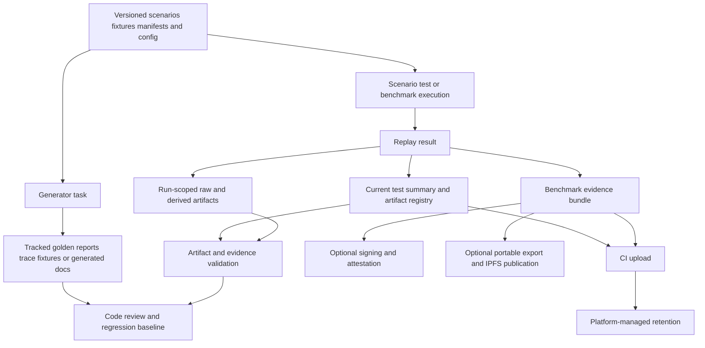
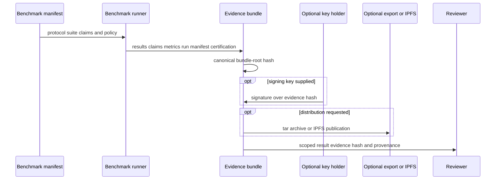

# Artifact Lifecycle Architecture

**Status:** Canonical companion to the evidence architecture and generated-document guidance.

This document distinguishes versioned inputs and baselines from generated local output, per-run evidence, portable benchmark bundles, and CI uploads. It is intended to prevent accidental edits to generated material and overstatement of what an artifact proves.

## 1. Artifact classes

| Class | Primary locations | Source-controlled? | Lifecycle | Intended use |
|---|---|---:|---|---|
| Executable inputs | `scenarios/`, `suites/`, `data/`, `benchmarks/`, `config/` | Yes | Edited deliberately, reviewed as source | Define replay inputs, benchmark contracts, policies, and configuration. |
| Regression fixtures | `data/fixtures/traces/`, fixture EDN directories | Yes | Regenerated only after intended behavior change | Stable inputs for replay and regression. |
| Golden reports | `data/fixtures/golden/*.report.edn` | Yes | Regenerated through the golden workflow and reviewed | Pinned expected replay outcomes. |
| Reference expected outputs | `suites/*/expected/` plus `.sha256` files | Yes | Updated only as part of a deliberate reference-baseline change | Verification baseline for public/reference suites. |
| Generated documentation | `docs/scenarios.md`, generated state-machine docs | Yes | Regenerated from source definitions and committed | Human-readable derived project reference. |
| Local execution output | `results/`, `target/`, `suites/*/actual/` | No | Replaceable and normally ignored | Development diagnostics and transient test products. |
| Run-scoped artifacts | `results/runs/<run-id>/` and current artifact directories | No | Created per invocation; inspect/export before cleanup | Evidence navigation and scenario-specific output. |
| Benchmark evidence bundles | Default `results/evidence/latest.edn` or caller-selected output | No by default | Generated, optionally signed/exported | Reproducible scoped benchmark evidence. |
| CI artifacts | GitHub Actions artifact storage | No | Retention controlled by CI platform/workflow | Review outputs of a particular workflow run. |

The `.gitignore` policy is the primary enforcement boundary: `results/`, build output, suite `actual/`/`reports/`, root-level forensic artifact roots, and demo-generated output are ignored. Do not bypass this policy with force-add unless a review process has explicitly identified a curated artifact to preserve.

## 2. Lifecycle overview

## 3. Inputs and tracked baselines

### 3.1 Executable input data

Scenarios, suites, fixture definitions, benchmark manifests, scoring definitions, schemas, and configuration are source artifacts. They define what a run means and must be reviewed before any derived output.

A scenario or benchmark result cannot be interpreted independently of the corresponding versioned inputs. The authoritative reproduction context is therefore the combination of source revision, selected inputs, and explicit runtime options—not merely a result file.

### 3.2 Trace fixtures and golden reports

`data/fixtures/traces/` contains versioned replayable traces. `data/fixtures/golden/` contains pinned `.report.edn` outcomes used for behavioral-drift detection. These files are generated test data, but they are checked in because they are regression baselines.

Use these rules:

1. Change the implementation or source scenario first.
2. Run the focused test to establish that the changed behavior is intentional.
3. Regenerate only the affected baseline through supported tasks such as `bb regenerate-goldens` or `bb fixtures:sync`.
4. Review the semantic diff; a changed golden file is a behavior change, not incidental formatting.
5. Commit the tracked baseline with the source change.

### 3.3 Reference-suite expected output

Reference suites keep expected artifacts and companion SHA-256 files under `suites/*/expected/`. A run writes its comparison-side output under `suites/*/actual/`, which is ignored. This separation makes the expected baseline reviewable while preserving ephemeral execution output.

### 3.4 Generated documentation

Generated documentation is tracked because it is a repository reference surface, but it must be regenerated rather than hand-edited. See `docs/reference/GENERATED_DOCUMENTS.md` for source-of-truth mapping and checks.

## 4. Local run artifacts

### 4.1 Scenario execution

`bb run:scenario`, scenario search, and `bb evidence:build` run a scenario through replay and create local output. The intended artifact families are:

| Family | Typical contents | Purpose |
|---|---|---|
| Replay output | Outcome, trace, metrics, final world | Raw result used by downstream extraction. |
| Per-run directory | Raw replay output plus trace, metric, mechanism, classification, and final-world summaries | Browsable scenario-specific evidence. |
| Current test-artifact directory | Test summary, run manifest, classification, artifact registry, and optional validation/evidence files | Current invocation’s machine-readable validation surface. |
| Optional saved output | User-selected copy from `--save-output` | Preserved local demonstration or investigation output. |

The extractor records a `derived_from` path and SHA-256 for derived scenario summaries, preserving a link back to `raw/replay-output.json`. Derived summaries are aids for navigation and analysis; the raw replay output remains the direct execution record.

### 4.2 Artifact registry

The artifact registry records an artifact ID, kind, path, importance, schema/contract version, producer, SHA-256, byte size, modification time, declared dependencies, and verification relationships. The configured importance tiers are:

| Tier | Meaning | Typical role |
|---|---|---|
| `CORE` | Required evidence-chain material | Run manifests, summaries, signatures, envelope, event evidence. |
| `DIAGNOSTIC` | Helpful review and debugging material | Coverage, findings, issues, telemetry, comparisons. |
| `TRACE` | Lowest-level trace detail | High-volume supporting trace material. |

Registry filtering begins from the requested importance level and includes required input dependencies. This ensures that a selected artifact is not presented without declared prerequisite artifacts when they are available.

### 4.3 Finalization behavior

The artifact emitter writes manifest, summary, and classification JSON atomically. It refuses to overwrite a target directory that already contains `signature.json` or `envelope.json`; signing/finalization therefore makes that target directory immutable to the emitter. Start a new run directory rather than modifying a signed evidence set.

## 5. Benchmark evidence lifecycle

Benchmark execution writes an EDN bundle to the selected output path (default `results/evidence/latest.edn` in the benchmark CLI). It includes the resolved manifest, repository/environment context, results, metrics, claim outcomes, concept coverage, a run manifest, certification, and `:evidence/hash`.

An optional signature attests to the evidence hash. Export creates a deterministic tar.gz containing selected bundle sections; IPFS publication adds distribution metadata. Neither signature nor publication validates the workload’s semantic claims beyond the cryptographic commitment to the exported/hash content.

## 6. CI artifact lifecycle

CI workflows can upload ignored local output so it is available for a specific workflow review:

- `results/test-artifacts/` as test artifacts;
- `results/ci-bundle/` as an evidence bundle;
- suite-specific `actual/` output where configured;
- coverage and reference-validation outputs in their respective workflows.

Uploaded CI artifacts are not repository source and should not be treated as permanent evidence unless a deliberate archival/export process captures them elsewhere. The workflow's selected commands, commit, environment, and retention policy bound their meaning.

## 7. Root naming and configuration boundary

There are two currently implemented naming families:

| Family | Locations | Used by |
|---|---|---|
| Results-root convention | `results/test-artifacts/`, `results/runs/`, `results/evidence/`, `results/ci-bundle/` | Test runner, Babashka scenario/evidence tasks, CI workflow paths, and much contributor documentation. |
| Evidence-config convention | `prf-artifacts/`, `prf-runs/`, `prf-bundles/` | Top-level paths declared in `config/evidence.json` and consumers that resolve those values directly. |

The project currently contains both conventions. Callers must inspect the invoked task/configuration instead of assuming all tools write to the same root. This is an implementation/configuration inconsistency that should be resolved before claiming one universal artifact location. See the **Known issue** in the final section.

## 8. Contributor decision table

| You changed… | Update or regenerate… | Commit it? |
|---|---|---:|
| Scenario semantics or replay behavior | Focused traces/golden reports only when expected behavior changes | Yes, if tracked baselines change intentionally |
| Fixture suite/reference output | `suites/*/expected/` and hashes only through reference-baseline process | Yes, after review |
| Generated-doc source | Corresponding generated Markdown and check target | Yes |
| Benchmark manifest/claims | Focused benchmark evidence for review | Usually no; evidence bundle is local unless explicitly curated |
| Test or scenario run | `results/`, `target/`, `actual/` outputs | No |
| Evidence contract/schema | Schema, config, producer/consumer tests, and documentation | Yes for source changes; no for run output |
| A signed run | New output directory for any revised evidence | Do not mutate the signed directory |

## 9. Operational principles

1. **Inputs precede outputs.** Interpret generated evidence only with the versioned source inputs and runtime configuration that produced it.
2. **Tracked generated data is a baseline.** Golden reports and expected suite output are reviewed behavioral contracts, not cache files.
3. **Local output is disposable.** `results/`, `target/`, and suite `actual/` output can be removed and reproduced.
4. **Finalized evidence is immutable.** Never overwrite a directory containing an evidence envelope or signature.
5. **Distribution is not validation.** CI upload, a tarball, IPFS publication, or a signature does not expand the scope of what the run established.
6. **Follow the producer.** The task, CLI, or config that produced an artifact defines its exact path and schema version.

## 10. Related documents

- `docs/reference/GENERATED_DOCUMENTS.md` — tracked generated documentation and fixtures.
- `schemas/README.md` — JSON schema catalogue.
- `docs/architecture/EVIDENCE_CHAIN_ARCHITECTURE.md` — evidence-chain integrity model.
- `docs/architecture/EVIDENCE_DAG_ARCHITECTURE.md` — evidence DAG topology.
- `docs/architecture/BENCHMARK_EXECUTION_ARCHITECTURE.md` — benchmark bundle lifecycle.
- `docs/evidence/RESEARCHER_EVIDENCE_PACK.md` — researcher-facing reproduction workflow.
- `docs/operations/LOCAL_SERVICES.md` — local service and forensic-runtime guidance.
