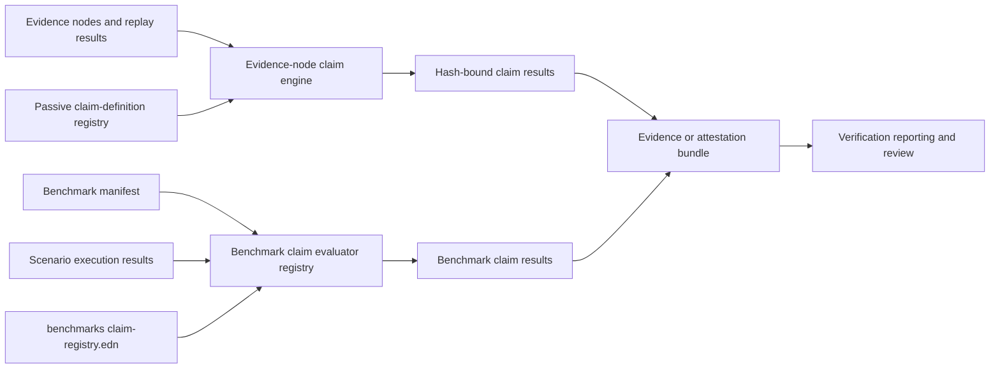
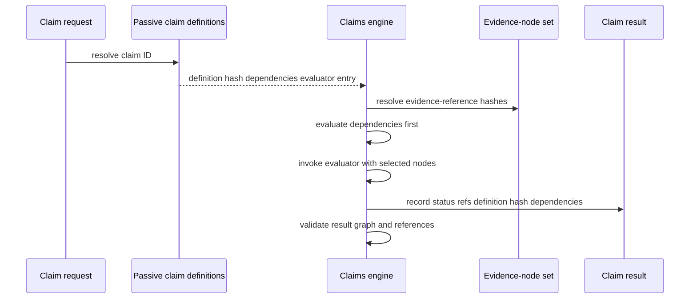
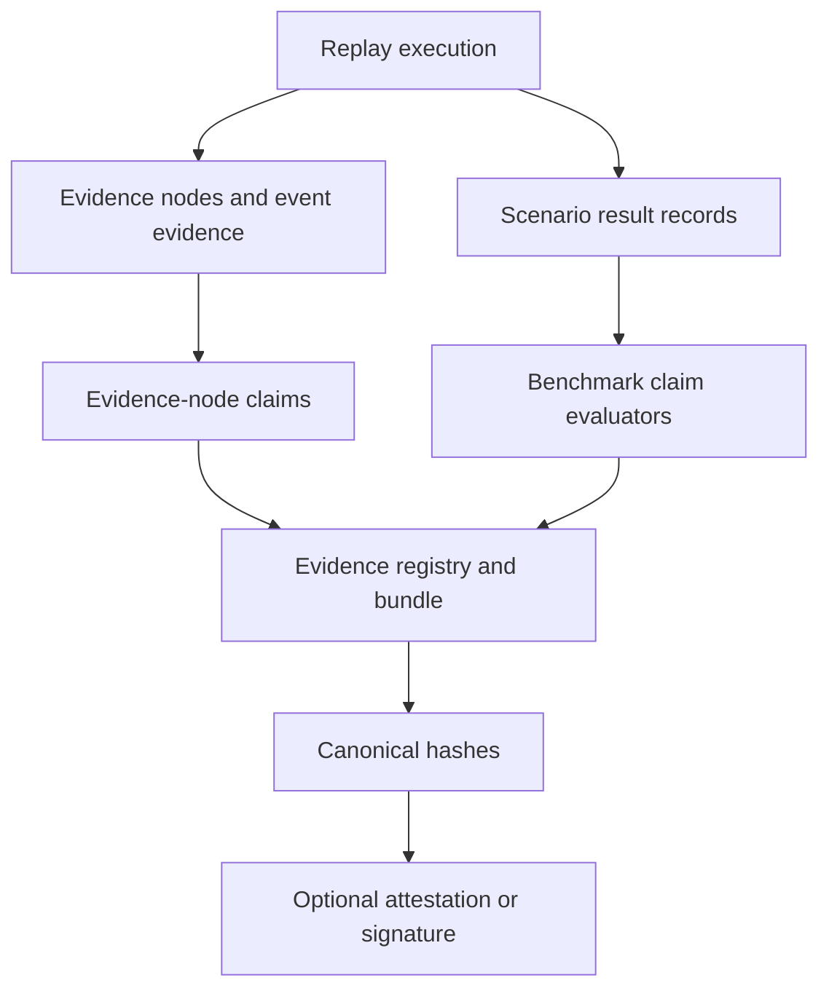

# Claims and Registry Architecture

**Status:** Canonical companion to the claim, evidence, attestation, and benchmark specifications.

This document describes how the framework gives evidence-derived conclusions stable identifiers, definitions, hashes, dependencies, and validation rules. It also distinguishes the two implemented evaluation paths: evidence-node claims and benchmark claims.

## 1. Core model

A claim is a conclusion derived from defined inputs. It is not an observation, a scenario label, or a benchmark status.



The same claim idea appears in both paths, but their registries, inputs, result shapes, and persistence stages are currently distinct.

## 2. Registry layers

| Registry | Runtime location | Primary purpose | Identity model |
|---|---|---|---|
| Passive claim-definition registry | `resolver-sim.definitions.passive-registries` | Define evidence-node claim semantics, dependencies, evaluator entry points, and canonical definition hashes | Canonical claim-definition hash and conceptual/dependency hash |
| Benchmark claim catalogue | `benchmarks/claim-registry.edn` | Describe benchmark claim purpose, property types, concepts, named invariants, and evaluator ID | Stable claim keyword; declarative catalogue entry |
| Benchmark evaluator registry | `resolver-sim.benchmark.claims/evaluator-registry` | Dispatch a claim ID to a scenario- or benchmark-scoped runnable evaluator | Claim ID equals evaluator ID by convention |
| Attestor registry | Passive registries and attestation modules | Authorize identities and keys that sign/verify attestations | Canonical attestor registry entry and key authorization |
| Evidence registry | `resolver-sim.evidence.chain` and post-run registry tooling | Index emitted artifacts/evidence hashes for a run | Registry hash and evidence/artifact hashes |

All registry classes are related, but they solve different problems. A claim definition does not itself prove a claim; an evaluator does not itself establish evidence provenance; an attestation does not itself validate a claim's semantics.

## 3. Evidence-node claim path

`resolver-sim.claims.engine` evaluates requests against persisted evidence nodes and a passive claim-definition registry.



### 3.1 Request and result contracts

A request identifies a claim and the evidence-node hashes it consumes:

```clojure
{:claim-id :claim/example
 :evidence-references ["<node-hash>" ...]}
```

The engine resolves dependencies deterministically, evaluates dependencies before dependents, and records:

```clojure
{:claim-id :claim/example
 :claim-definition-hash "<canonical-hash>"
 :evidence-references ["<node-hash>" ...]
 :depends-on [:claim/dependency]
 :holds? true
 :status :pass}
```

The engine validates that definitions exist, definition hashes match, evidence references are non-empty and resolvable, dependencies are present, and dependency graphs are acyclic.

### 3.2 Failure behavior

The evidence-node engine rejects unknown definitions, missing evaluators, and dependency cycles during evaluation. Validation reports orphaned claims, unresolved evidence, definition-hash mismatch, missing dependency results, and cycles.

This path is intended for reproducible claims whose identity is bound to the selected evidence-node set and claim-definition registry state.

## 4. Benchmark claim path

Benchmark manifests declare claims alongside workload, scoring, evidence-policy, and lifecycle metadata. `resolver-sim.benchmark.claims` evaluates the manifest claims over benchmark scenario results.

### 4.1 Scopes

| Scope | Evaluation input | Evaluation frequency |
|---|---|---|
| `:scenario` | One replay result, its metrics, invariant observations, and selected artifacts | Once for each scenario execution |
| `:benchmark` | Full result collection and manifest | Once for the benchmark run |

Benchmark claim results use a presentation-oriented shape:

```clojure
{:claim/id :claim/funds-conserved
 :claim/scope :scenario
 :claim/outcome :pass
 :claim/severity :critical
 :claim/evidence [:invariant-failed]
 :scenario/id "..."}
```

The evaluator registry is executable dispatch. It returns `:pass`, `:fail`, `:not-exercised`, or `:not-implemented` based on whether the selected workload emitted sufficient evidence and whether the evaluator could decide the claim.

### 4.2 Lifecycle gates

For active benchmarks, `resolver-sim.benchmark.coverage` requires all required claims to be known, runnable, substantive, mapped to advertised properties, non-deferred, and passing. Experimental benchmarks may retain deferred or incomplete claims, but successful scenarios must not be represented as active semantic assurance.

A benchmark scenario result and a claim result are different statements:

- A scenario `:pass` means the declared replay completed under its expectations.
- A claim `:pass` means its evaluator ran against the available result/evidence and held.
- `:not-exercised`, `:not-implemented`, and `:inconclusive` are not passes.

## 5. Evidence, hashing, and attestation boundaries



- Evidence-node claims reference evidence-node hashes and claim-definition hashes.
- Benchmark claims currently reference result-level evidence categories and scenario identity/path fields.
- Evidence registry hashes establish integrity of declared registered artifacts.
- An optional signature or attestation proves signing of a hash by a configured key; it does not independently establish that the claim evaluator, scenario population, or protocol model is complete.

## 6. Claim-definition dependencies

Passive claim definitions may declare `:depends-on`. The passive registry enriches dependency references with conceptual hashes and topologically orders definitions. The claims engine evaluates dependencies before dependents and rejects cycles.

Benchmark claims can also have logical dependencies through their evaluator implementation and manifest lifecycle requirements, but the benchmark evaluator path does not currently emit the same hash-bound dependency record shape as the evidence-node claims engine.

## 7. Current separation and review implications

The project currently has two claim-result contracts:

| Concern | Evidence-node engine | Benchmark evaluator path |
|---|---|---|
| Definition source | Passive in-code registry | Benchmark EDN catalogue plus manifest |
| Evaluator binding | Definition `:evaluation :entry` or injected resolver | `evaluator-registry` keyed by claim ID |
| Evidence input | Explicit evidence-node hashes | Replay result, metrics, invariant results, allocation decisions |
| Definition hash recorded | Yes | Not currently part of the standard benchmark claim result |
| Dependency result graph | Yes | Not emitted in the same result shape |
| Main consumer | Attestation/evidence workflows | Benchmark bundles, scoring, reviewer reports |

This separation is intentional in current code but should be visible to reviewers. Do not state that a benchmark claim is hash-bound to a passive claim definition unless the run artifact explicitly contains that definition hash and evidence-node references.

## 8. Recommended future convergence

The current architecture supports a staged convergence without replacing either path:

1. Add the passive claim-definition hash to benchmark claim results where a matching definition exists.
2. Preserve explicit evidence-node references in benchmark claim results when scenario artifact packages contain them.
3. Emit benchmark claim dependencies in the evidence-node result shape where meaningful.
4. Validate benchmark manifests against both the declarative claim catalogue and the passive registry for claims designated as evidence-bound.
5. Keep result-level evaluators for workload-specific aggregation, but make their evidence/provenance links explicit in the benchmark bundle.

Until that work is complete, benchmark results and evidence-node claims should be described as complementary rather than interchangeable.

## 9. Review checklist

For a claim presented to an external reviewer, verify:

1. The claim ID and plain-language meaning are explicit.
2. The applicable registry/definition source is identified.
3. The evaluator and scope are known.
4. The scenario/workload that exercised the claim is identified.
5. Evidence references or result fields are available and sufficient.
6. The outcome is distinguished from scenario pass/fail.
7. The benchmark lifecycle status is visible.
8. Any attestation/signature is described as hash provenance, not semantic proof.

## 10. Related documents

- `docs/specs/CLAIMS_SPEC_V1.md`
- `docs/specs/CLAIM_DEFINITION_REGISTRY_SPEC_V1.md`
- `docs/specs/ATTESTATION_SPEC_V1.md`
- `docs/specs/ATTESTOR_REGISTRY_SPEC_V1.md`
- `docs/specs/BUNDLE_VERIFICATION_SPEC.md`
- `docs/architecture/EVIDENCE_CHAIN_ARCHITECTURE.md`
- `docs/architecture/BENCHMARK_EXECUTION_ARCHITECTURE.md`
- `benchmarks/README.md`
