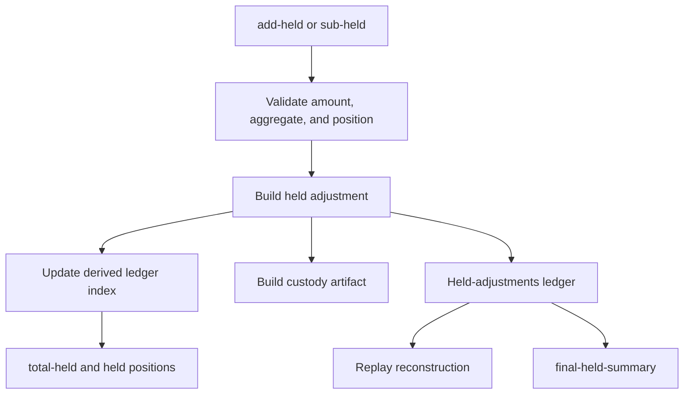
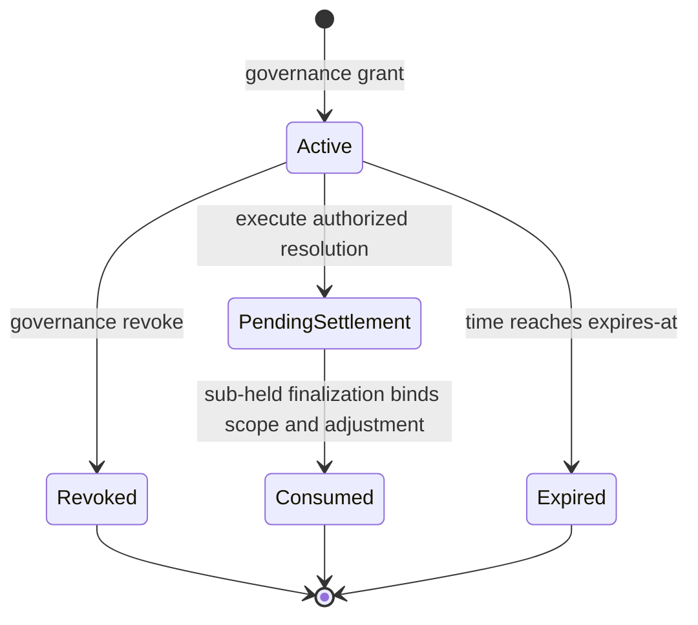

# Held Custody Accounting and Force-Authorisation

## Purpose

Sew tracks custody with an append-only held-adjustment ledger. It records why an amount entered or left custody, the token and workflow position affected, and the authorization that permits exceptional movement. This document explains the relationship between the ledger, settlement, derived final-held reporting, and force-authorisation.

The ledger is a simulation and evidence mechanism. It does not establish on-chain custody or replace a deployed contract's accounting.

## Source of truth and derived views

`world[:held-adjustments]` is the canonical in-memory custody history. Every canonical `add-held` or `sub-held` mutation appends one adjustment and one content-addressed custody artifact.

The following are derived/materialized views, not independent sources of truth:

- `:held-ledger/index :by-token` — token-level held custody.
- `:held-ledger/index :by-position` — reason-derived custody positions.
- `:held-ledger/index :by-account` — account categories.
- `:held-ledger/index :by-workflow` — workflow allocations.
- `:total-held` — compatibility view of `:by-token`.
- `:held/positions` — compatibility view of `:by-position`.
- `:held-artifacts` — deterministic artifacts derived from held adjustments.
- `final-held-summary` — reviewer-facing derived report.



## Canonical adjustment model

`resolver-sim.protocols.sew.accounting/add-held` and `sub-held` use the same `adjust-held` path. Their required call shape is:

```clojure
(acct/add-held world token amount
  {:action "create-escrow"
   :reason :escrow-principal-deposited
   :extra {:held/workflow-id workflow-id
           :owner/address sender}})

(acct/sub-held world token amount
  {:action "finalize-released"
   :reason :escrow-settlement-released
   :extra {:held/workflow-id workflow-id
           :owner/address recipient}})
```

Each adjustment includes at least:

```clojure
{:held-adjustment/id "held-adjustment-7"
 :held/direction :in | :out
 :token token
 :amount amount
 :held/before aggregate-token-balance
 :held/after aggregate-token-balance
 :held/reason reason
 :held/action action
 :held/account derived-account
 :held/position-id derived-position-id}
```

Reasons in the held-position policy derive an account and a position scope. Examples include escrow principal, yield custody, appeal bonds, and resolver yield. An outflow must pass both aggregate token and position-level underflow checks. Address-scoped reasons require `:owner/address`.

Use of `add-held` for resolver stake is prohibited: resolver stake is represented by `:resolver-stakes`, not `:total-held`.

## Settlement and terminal custody

Escrow creation records principal custody. Release, refund, and partial release reduce the same workflow's `:escrow-principal` position using the registered settlement reason and recipient scope.

Finalization may also process yield and deferred-yield custody. Terminal-workflow checks require:

- principal custody for a terminal workflow is zero;
- yield-custody equals explicitly deferred yield, where applicable.

This prevents a terminal escrow from leaving unallocated principal custody behind while preserving a separately represented deferred yield liability.

## Yield accounting boundary and negative yield

Generic yield modules calculate position state, valuation, shortfall, and cumulative `:total-yield-generated`. They do **not** directly mutate `:total-held`, create a claimable, or represent a payout. Protocol lifecycle code owns those custody semantics.

For Sew escrow yield, `lifecycle/accrue-yield` observes the resulting position delta and records canonical `:yield-accrued` held adjustments. Deferred recovery uses `lifecycle/apply-deferred-yield-claim-settlement`, which removes recovered value from the workflow's `:yield-custody` partition and creates a `:settlement/yield` claimable for the terminal recipient.

Negative mark-to-market yield first debits the workflow `:yield-custody` partition. If that partition cannot absorb the full loss, Sew records the residual with `:yield-negative-excess` against escrow-principal custody. This is an explicit modeled principal-impairment policy, not a generic yield-module operation; position and aggregate custody underflow checks still apply.

Token keys are canonicalized at module/protocol ingress. The registered `:yield/token-key-consistency` invariant rejects simultaneous string and keyword keys for the same normalized token in primary accounting maps, because those representations would otherwise split custody.

## Replay and final-held reporting

`replay-held-adjustment-state` replays adjustments into token, position, account, owner, and workflow indexes. When `[:params :held-adjustments/complete?]` is true, invariants require replayed views to match the materialized world and custody artifacts to be derived exactly from adjustments.

`final-held-summary` is a concise derived surface for scenario reports and benchmark packages:

```clojure
{:by-token
 {:USDC {:opening 0 :in 1000 :out 1000 :final 0}}
 :by-workflow
 {42 {:token :USDC
      :principal-final 0
      :yield-custody-final 0
      :final-held 0}}
 :ledger-adjustment-count 2
 :reconstruction-valid? true}
```

It is intentionally not persisted as an authoritative balance. Reviewers should treat `:reconstruction-valid? false` as a signal to inspect the ledger and materialized views before relying on the summary.

## Force-authorisation

Force-authorisation is a narrow, governance-created exception for a disputed workflow whose normal resolution path is unavailable. It is not general governance authority and is not proof of on-chain authorization.

A grant commits to the exact custody movement:

```clojure
{:authorization/id auth-id
 :authorization/type :force-authorisation
 :held/direction :out
 :token token
 :amount amount
 :held/account :escrow-principal
 :owner/address recipient
 :held/reason :force-authorised-release | :force-authorised-refund
 :held/workflow-id workflow-id}
```

The commitment is domain-hashed using `force-authorisation-scope` and stored with the persisted grant under `:force-authorisations`.

### Lifecycle



Execution validates that the grant exists, is active and in-window, is bound to the workflow and allowed action, and has an exact scope/hash match. It records execution provenance but does **not** consume the grant.

Consumption occurs only at the final `sub-held` operation. The accounting layer then reloads the persisted grant and verifies the actual token, amount, recipient, reason, direction, and workflow against its committed scope. In the same state transition it appends the held adjustment, stores a consumption entry, and marks a single-claim grant consumed.

This placement matters: the consumption record is linked to the actual custody movement and its `:held-adjustment/id`, rather than only to a decision submission.

### Related claims

A related-claims grant contains an authorized set of member scope hashes. Each successful member settlement consumes exactly one member hash. The grant remains active until every committed member scope has been consumed; only then does it become terminally consumed.

The force-authorisation lifecycle invariant checks persisted grants, consumption entries, and held-adjustment linkage. The related-claims scope invariant additionally checks relationship existence, activity, hash consistency, and membership bounds.

## Evidence and review boundaries

Held custody artifacts are content-addressed and chain to the preceding artifact hash. Force-authorised held adjustments preserve authorization provenance needed to relate the custody movement to its grant.

For an external evidence package, include:

1. scenario input and replay result;
2. `:held-adjustments` and `:held-artifacts` from the resulting world/evidence package;
3. `final-held-summary` output;
4. force-authorisation and consumption maps when exercised;
5. the applicable invariant result and evidence bundle.

A passing reconstruction or force-authorisation invariant demonstrates consistency within the modeled scenario. It does not demonstrate Solidity/EVM equivalence, deployed authorization, or comprehensive protocol assurance.

## Contract payout solvency

`:contract-payout-solvency` is distinct from the internal held-custody reconciliation check. It verifies that an observed ERC-20 balance for each custody contract can pay the modeled outstanding obligations assigned to that contract.

Attach an external snapshot to the world in either accepted form:

```clojure
{:solvency/contract-balances
 {[:escrow-vault :USDC] 1000000}}

;; or
{:solvency/contract-balances
 {:escrow-vault {:USDC 1000000}}}
```

Token routing defaults to `:escrow-vault` and may be overridden per token:

```clojure
{:params
 {:solvency/token-custody-contracts
  {:USDC :escrow-vault}}}
```

For each token, the current conservative liability total is:

```text
total-held + all canonical claimable-v2 entries + total-fees + bond-fees
```

Legacy `:claimable` is excluded because settlement principal and yield are dual-written there. The invariant reports `:coverage :unverified` when no snapshot is present, and reports either a missing contract balance or a payout shortfall when evidence is incomplete or insufficient. This is the model-side verifier; collecting `IERC20.balanceOf` values and binding them to a chain block, vault address, and ABI/deployment provenance remains the responsibility of an EVM/RPC adapter.

## Key implementation and validation locations

| Concern | Location |
|---|---|
| Ledger primitives, artifact derivation, reconstruction, final summary | `protocols_src/resolver_sim/protocols/sew/accounting.clj` |
| Escrow creation, partial release, finalization, yield custody | `protocols_src/resolver_sim/protocols/sew/lifecycle.clj` |
| Grant, revoke, and force-authorised execution actions | `protocols_src/resolver_sim/protocols/sew.clj` |
| Pending-settlement finalization | `protocols_src/resolver_sim/protocols/sew/resolution.clj` |
| Custody and force-authorisation invariants | `protocols_src/resolver_sim/protocols/sew/invariants.clj` |
| Ledger tests | `protocols_src/test/resolver_sim/protocols/sew/accounting_test.clj` |
| Grant/execute/revoke/expiry and related-claims tests | `protocols_src/test/resolver_sim/protocols/sew/force_authorisation_test.clj` |

## Related documents

- `docs/architecture/RESOLVER_OVERFLOW_AND_FORCE_AUTHORISATION.md`
- `docs/architecture/ARTIFACT_LIFECYCLE_ARCHITECTURE.md`
- `docs/architecture/CLAIMS_AND_REGISTRY_ARCHITECTURE.md`
- `docs/specs/CLAIMS_SPEC_V1.md`
- `docs/specs/BUNDLE_VERIFICATION_SPEC.md`
