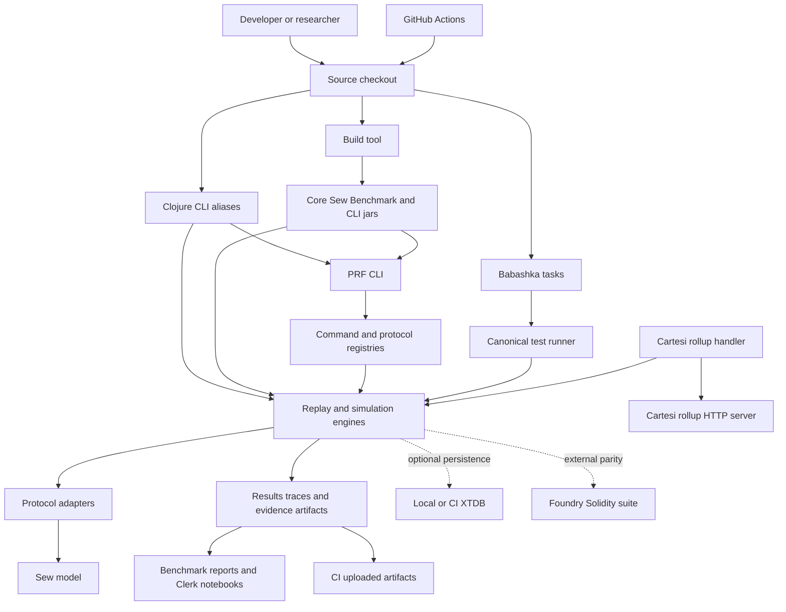
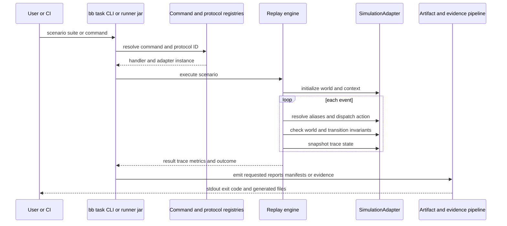

# System Context and Runtime Topology

**Status:** Canonical companion to `ARCHITECTURE.md`.

This document describes how people, processes, artifacts, and optional external systems connect at runtime. It intentionally does not redefine replay semantics, evidence formats, or adapter contracts; see the linked architecture and specification documents for those details.

## 1. Scope and non-goals

The Protocol Robustness Framework (PRF) is a JVM/Clojure framework for deterministic protocol replay, invariant validation, statistical simulation, and evidence production. The included Sew model is the principal protocol implementation.

This document covers:

- supported source-checkout and built-jar execution surfaces;
- protocol selection and replay boundaries;
- CI, generated artifacts, and optional local services;
- external integration boundaries.

It does not claim that every runtime path is production-ready. In particular, experimental research, optional integrations, and forensic isolation have their own readiness and threat-model documents.

## 2. System context



### Actors and trust boundaries

| Actor/system | Responsibility | Trust and boundary notes |
|---|---|---|
| Developer or researcher | Authors protocols, scenarios, fixtures, and invokes local tools | Local commands may create untracked output under `results/`. |
| GitHub Actions | Runs declared validation jobs and uploads artifacts | CI configuration is a separate operational boundary; passing CI is only as strong as its selected gates. |
| PRF replay engine | Executes events against a selected adapter and evaluates invariants | The engine is protocol-agnostic; protocol semantics live behind adapter interfaces. |
| Protocol adapter | Supplies world construction, action dispatch, checks, and projections | Adapters must be deterministic and must not use hidden I/O for protocol semantics. |
| Artifact/evidence pipeline | Serializes results, traces, manifests, and evidence bundles | Evidence verification establishes internal integrity, not external truth beyond declared inputs and trust assumptions. |
| XTDB | Optional persistence/telemetry service | Not required for ordinary deterministic replay. Local Compose credentials are development-only. |
| Foundry/Solidity environment | Separately replays or compares selected traces | Not part of the normal source-checkout runtime; both layers are needed for equivalence claims. |
| Cartesi rollup server | External HTTP integration target | The handler is a distinct integration process and maintains in-memory request metrics. |

## 3. Execution surfaces

### 3.1 Source checkout

The source checkout is the primary contributor environment.

| Surface | Entry point | Primary use |
|---|---|---|
| Babashka | `bb <task>` | Supported contributor workflows, scenario wrappers, tests, evidence, and generated-document tasks. |
| Clojure CLI | `clojure -M:<alias>` / `clojure -X:<alias>` | Direct JVM execution, REPLs, build aliases, and focused namespace work. |
| Test runner | `./scripts/test.sh <target>` | Canonical broad, fast, and target-specific validation. |
| Make | `make <target>` | Generated-document checks, reference suites, and local service helpers. |

The default Clojure classpath contains framework code. Add `:with-sew` for the Sew implementation and its tests. The source-layout boundary is deliberate:

```text
src/                 framework, CLI, evidence, orchestration, integrations
protocols_src/       Sew model and protocol-specific tests
resources/           classpath command registry and runtime resources
scenarios/, suites/  executable scenario and validation data
results/             generated local output, not source
```

### 3.2 Built jars

`clojure -T:build uberjar` builds the following variants:

| Variant | Default entry point | Intended runtime boundary |
|---|---|---|
| `core` | `resolver-sim.replay-core` | Core replay verification without protocol-specific implementation paths. |
| `sew` | `resolver-sim.sew-bootstrap` | Sew scenario and suite replay. |
| `benchmark` | `resolver-sim.benchmark.main` | Portable benchmark execution with embedded benchmark resources. |
| `cli` | `resolver-sim.cli.main` via bootstrap | Registry-backed PRF command interface. |

The build copies source and resources into jar artifacts. The benchmark variant additionally embeds scenario, benchmark, suite, data, and configuration directories. Refer to `docs/reference/build.md` for build and portable-invocation details.

### 3.3 CI

GitHub Actions installs the JVM/Clojure toolchain and selects specific validation paths. CI commonly uploads outputs from `results/test-artifacts/`, suite-specific `actual/` directories, and evidence-bundle directories. These artifacts are execution evidence for the selected workflow; they are not automatically permanent releases or proof of all protocol properties.

## 4. Runtime flow

### 4.1 Deterministic replay



The protocol registry in `src/resolver_sim/protocols/registry.clj` resolves adapters lazily by symbol. Current registered IDs are `sew-v1`, `yield-v1`, and `dummy`; the default is `sew-v1`.

The mandatory `SimulationAdapter` contract is defined in `src/resolver_sim/protocols/protocol.clj`. It supports initialization, action dispatch, single-state and transition checks, snapshots, available-action discovery, ID aliasing, created-ID extraction, open-entity reporting, and state projections. `EconomicModel` and `AnalysisModule` are optional capabilities used for specialized metrics and analysis.

### 4.2 Command dispatch

The PRF CLI reads `resources/prf/commands/registry.edn`, parses a command path, then lazily resolves the matching handler in `src/resolver_sim/cli/dispatch.clj`. Registered native commands cover validation, evidence checks, scenario execution, invariants, benchmarks, formatting, and linting.

Babashka tasks are a second, contributor-oriented surface. They may wrap a Clojure alias, the test runner, or evidence scripts. The command registry validation path checks registry, dispatch, and Babashka-wrapper parity; task definitions and their side effects remain authoritative in `bb.edn`.

### 4.3 Statistical simulation

Monte Carlo and parameter-sweep paths execute the `sim/`, `stochastic/`, `economics/`, and `adversaries/` layers. They are distinct from deterministic replay: they consume explicit parameter files and may produce aggregate results rather than a canonical step trace. `docs/architecture/REPLAY_ENGINE_ARCHITECTURE.md` defines this two-engine boundary.

## 5. Data, artifact, and persistence topology

| Location/system | Contents | Lifecycle |
|---|---|---|
| `scenarios/`, `suites/`, `data/`, `benchmarks/`, `config/` | Versioned executable inputs and definitions | Source-controlled; benchmark jars embed a defined subset. |
| `resources/prf/commands/registry.edn` | CLI command metadata | Source-controlled classpath resource. |
| `results/` | Local reports, traces, artifact registries, bundles, and test summaries | Generated; normally not committed. |
| `target/` | Build output and CLI defaults | Generated; replaceable. |
| CI workflow artifact storage | Uploaded test/evidence outputs | Retention is governed by GitHub Actions configuration. |
| XTDB | Optional telemetry and persistence | Disposable local Compose service by default; see `docs/operations/LOCAL_SERVICES.md`. |

The evidence architecture is described by `EVIDENCE_CHAIN_ARCHITECTURE.md`, `EVIDENCE_DAG_ARCHITECTURE.md`, and the specifications under `docs/specs/`. Generated-document and fixture rules are in `docs/reference/GENERATED_DOCUMENTS.md`.

## 6. External integration boundaries

### 6.1 XTDB

XTDB is optional. `config/docker-compose.yaml` exposes a PostgreSQL-wire endpoint on port `5432`; CI may also provide it as a service. Event-time remains the protocol-semantic clock, while XTDB valid-time and host record time serve persistence and operational purposes. See `ARCHITECTURE.md` for the temporal contract.

### 6.2 Solidity / Foundry

Trace-equivalence assertions span two independently run layers: model-side comparison in this repository and Forge execution in the Solidity environment. A model result alone is not an EVM-equivalence claim. The required validation sequence is documented in `docs/testing/RUNNING_TESTS.md`.

### 6.3 Cartesi handler

`resolver-sim.cartesi.handler` is a long-running integration entry point. It reads hex-encoded JSON scenarios from the configured `ROLLUP_HTTP_SERVER_URL`, replays them with the default protocol, emits a notice containing the result, and maintains an in-memory bounded metrics/history map for inspect requests. Errors emit Cartesi reports and reject advance requests.

The handler is an integration boundary, not the canonical local replay interface. It currently selects the default protocol rather than accepting protocol selection in the Cartesi request.

### 6.4 Clerk and notebooks

Clerk is an optional presentation surface. It consumes report-ready data and generated artifacts for interactive analysis; it does not establish additional protocol correctness. The `:clerk`, `:build-clerk`, and `:observability` aliases provide local entry points.

## 7. Operational principles

1. **Keep protocol semantics pure.** Adapter and domain logic must not derive semantics from filesystem, wall-clock, database, or network state.
2. **Make runtime mode explicit.** A command should make clear whether it is framework-only, Sew-enabled, benchmark-portable, experimental, or integration-specific.
3. **Treat artifacts by class.** Versioned inputs, generated local results, CI uploads, and evidence bundles have different retention and review rules.
4. **Do not overstate validation.** A passing test, replay, evidence check, or benchmark supports only its declared scope.
5. **Keep external dependencies optional unless a workflow says otherwise.** XTDB, Foundry, Cartesi, and forensic isolation are not prerequisites for basic source-checkout replay.

## 8. Related documents

- `docs/architecture/ARCHITECTURE.md` — layering, temporal semantics, namespace map, and adapter design.
- `docs/architecture/REPLAY_ENGINE_ARCHITECTURE.md` — deterministic replay and statistical-engine internals.
- `docs/architecture/EVIDENCE_CHAIN_ARCHITECTURE.md` — evidence-chain lifecycle and integrity model.
- `docs/architecture/EVIDENCE_DAG_ARCHITECTURE.md` — evidence DAG topology and validation.
- `docs/reference/usage.md` — commands and local entry points.
- `docs/reference/build.md` — jar variants and portable builds.
- `docs/operations/LOCAL_SERVICES.md` — local XTDB and forensic operational guidance.
- `docs/overview/CAPABILITY_STATUS.md` — implementation, evidence, and parity limitations.
