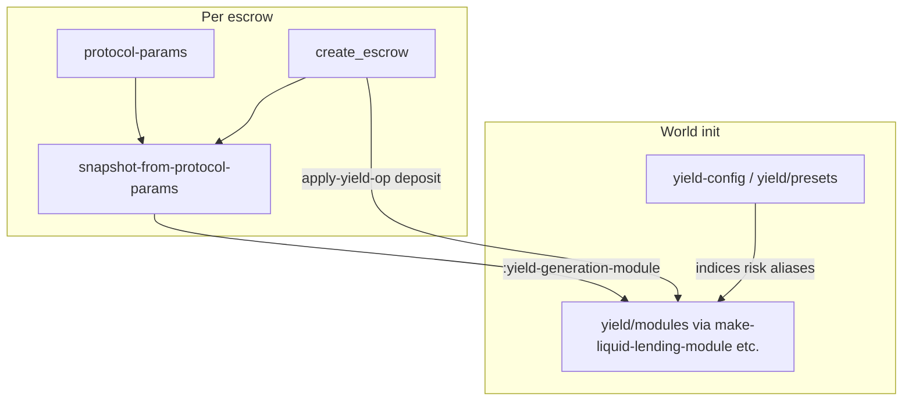

# Yield modules vs Sew escrow snapshots

New contributors often grep **“make-module”** and hit three different concepts. This page is the canonical map.

## Three “module” concepts (do not unify)

| Concept | Factory | Produces | Lifetime |
|---------|---------|----------|----------|
| **Yield module** | `yield/modules/*/make-*-module` | Declarative record (`:ops`, `:module/capabilities`) | Registered on world at init (`[:yield/modules id]`) |
| **Escrow snapshot** | `protocols/sew/snapshot/make-escrow-snapshot` | `ModuleSnapshot` (fees, bonds, yield **ids**) | Frozen per escrow at `create_escrow` (`[:module-snapshots wf-id]`) |
| **Resolution stub** | `protocols/sew/authority/make-*-resolution-module` | Function `(fn [wf caller] …)` | Simulation setup only |

There is **no** global `make-module`. **`types/make-module-snapshot` is deprecated** — use `make-escrow-snapshot` or test helpers in `snapshot-fixtures`.

## Data flow



## Yield: profile vs archetype vs registry id

| Id | Example | Role |
|----|---------|------|
| **Profile** | `:aave-v3` | Scenario label; registry entry with its own `:module/id` |
| **Archetype** | `:yield.provider/liquid-lending` | Shared op implementation; risk/indices paths in config |
| **Generation module** (on snapshot) | Often archetype id | What `create_escrow` uses for `apply-yield-op` |

`resolve-yield-profile` and `[:yield/module-aliases]` connect profile → archetype. See `test-aave-profile-snapshot-create-escrow-yield-coherence` in `snapshot_test.clj`.

## Where behaviour lives

| Concern | Where |
|---------|--------|
| Transition graph (deposit/accrue/withdraw) | Yield module `:ops` |
| APY, shortfall, negative yield | `yield-config`, `yield/presets`, `set-yield-risk`, world `[:yield/risk …]` |
| Escrow fee, appeal window, bonds | `ModuleSnapshot` (frozen) |
| Simulated time | World `:block-time`, not `updated-at` on snapshots |

**Do not** put stress modes in `make-liquid-lending-module` or `make-escrow-snapshot`.

## Canonical APIs

### Production-like / replay

```clojure
(require '[resolver-sim.protocols.sew.snapshot :as snap])

(snap/snapshot-from-protocol-params
  {:resolver-fee-bps 50          ;; maps to :escrow-fee-bps
   :yield-profile :aave-v3
   :appeal-window-duration 86400}
  {:world world :validate-world? true})
```

### Named fixtures

```clojure
(require '[resolver-sim.protocols.sew.snapshot-presets :as sew-presets])

(sew-presets/preset->snapshot :sew.preset/baseline)
(sew-presets/preset->snapshot :sew.preset/yield-aave)
```

Yield stress: `resolver-sim.yield.presets/apply-preset`.

### Tests (preferred)

```clojure
(require '[resolver-sim.protocols.sew.snapshot-fixtures :as snap-fix])

(snap-fix/escrow-snapshot {:escrow-fee-bps 50 :max-dispute-duration 3600})
(snap-fix/escrow-snapshot :sew.preset/dispute-heavy {:appeal-bond-bps 500})
(snap-fix/protocol-params-snapshot {:resolver-fee-bps 50 :dispute-resolver "0xR"})
```

Malformed fixtures only: `{:validate? false}` on `snapshot-from-protocol-params` or `escrow-snapshot`.

## Validation

- Yield: `yield.module/validate-module` at registry init
- Snapshot: `snapshot/validate-snapshot` — failures use `:error/type`, `:snapshot/field`, `:expected`, `:actual`, `:hint`

## Further reading

- `docs/v2/YIELD_ACCOUNTING_ARCHITECTURE.md` — accounting layers (not constructors)
- `src/resolver_sim/protocols/sew/snapshot.clj` — ns docstring
- `CLAUDE.md` — repository layout
