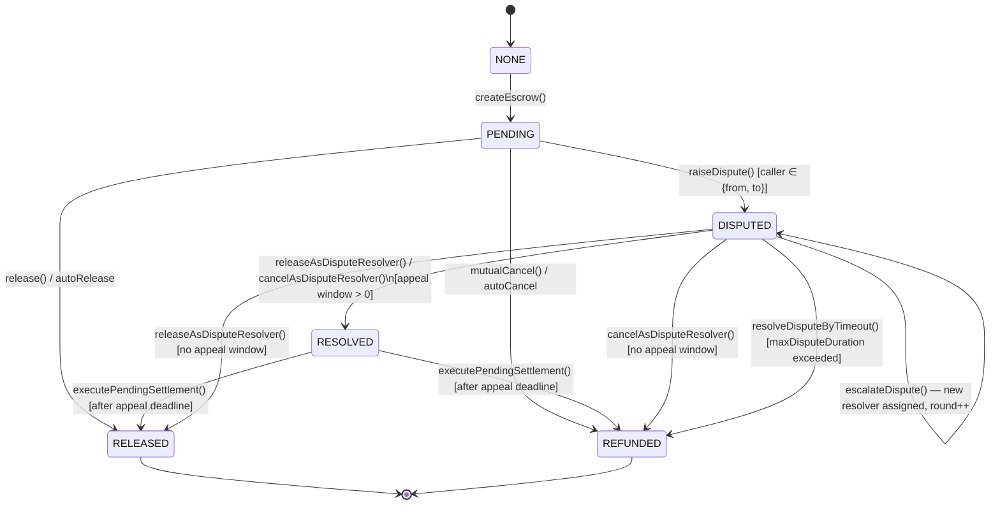

# Sew Protocol — Technical Reference

## 4. Dispute Resolution Architecture

> **Source**: Derived directly from the Sew Protocol smart contracts
> (`contracts/core/BaseEscrow.sol`, `contracts/ops/DisputeOps.sol`,
> `contracts/modules/decentralized-resolution-module/`,
> `contracts/arbitration/KlerosArbitrableProxy.sol`,
> `contracts/types/EscrowTypes.sol`, and supporting libraries).
> All claims in this section are grounded in contract code, not design intent docs.

---

### 4.1 Overview and design principles

Dispute resolution in Sew Protocol is module-based, multi-round, and snapshot-isolated.

The key design choices are:

- **Pluggable resolution module.** Every escrow records, at creation time, the address of the
  `IResolutionModule` that will govern any dispute arising from it. This address is frozen in an
  immutable `ModuleSnapshot`. Governance can replace the default module for future escrows but
  cannot alter the module recorded for an escrow that already exists.

- **Compute-then-apply pattern.** Dispute and escalation logic is computed by a stateless external
  contract (`DisputeOps`) and returned as a result struct. `BaseEscrow` applies the state change.
  This separates validation from state mutation and reduces `BaseEscrow`'s bytecode footprint.

- **Fixed escalation depth.** The `DecentralizedResolutionModule` (DRM) implements exactly three
  resolution rounds (rounds 0, 1, 2 — indexed from 0; `MAX_ROUND = 2`). Round 0 is a
  standard resolver, round 1 is a senior resolver, round 2 is an external resolver (Kleros). A
  dispute that exhausts all rounds without appeal is finalized at round 2.

- **Appeal restriction.** Only the losing party at any given round may appeal to the next round.
  A RELEASE decision (funds to recipient) can only be appealed by the sender; a CANCEL decision
  (refund to sender) can only be appealed by the recipient. `DisputeOps.computeEscalation` enforces
  this before allowing escalation.

- **Pending settlement / appeal window.** A resolver decision does not immediately settle funds.
  It creates a `PendingSettlement` record with an `appealDeadline`. The escrow remains in
  `DISPUTED` state during the appeal window. Settlement executes only when `executePendingSettlement`
  is called after the deadline, or is finalized immediately if no appeal window applies at that
  round.

- **Dispute timeout / liveness backstop.** If no resolver acts within `maxDisputeDuration`
  (snapshotted at creation), any account can trigger `resolveDisputeByTimeout`, which refunds
  the sender. This prevents escrows from being locked indefinitely by resolver inaction.

---

### 4.2 Escrow state model

The on-chain `EscrowState` enum defines six states:

```
NONE → PENDING → DISPUTED → RESOLVED
                 PENDING → RELEASED
                 PENDING → REFUNDED
```

| State      | Meaning                                                                |
|------------|------------------------------------------------------------------------|
| `NONE`     | No escrow at this index                                                |
| `PENDING`  | Funds held; awaiting release, cancel, or dispute                       |
| `DISPUTED` | Dispute raised; awaiting resolver decision, escalation, or timeout     |
| `RESOLVED` | Resolver decision recorded; pending settlement (appeal window active)  |
| `RELEASED` | Funds paid to recipient (final)                                        |
| `REFUNDED` | Funds returned to sender (final)                                       |

The transition `DISPUTED → RESOLVED` is an intermediate state used when an appeal window applies.
After the window expires, `executePendingSettlement` transitions to `RELEASED` or `REFUNDED`.

If no appeal window applies at the current round (e.g., the snapshotted `appealWindowDuration` is
zero, or the resolution module signals immediate finality), `BaseEscrow._executeResolution` settles
directly to `RELEASED` or `REFUNDED` without a `PendingSettlement` record.

State transitions are performed by `StateManagementLibrary`, which updates `et.escrowState` and
records `senderStatus` / `recipientStatus` as appropriate.

#### Mermaid state diagram



---

### 4.3 Dispute prerequisites and safety guards

`BaseEscrow.raiseDispute` enforces the following before transitioning to `DISPUTED`:

| Check | Source |
|-------|--------|
| Escrow must be in `PENDING` state | `DisputeOps.computeDisputeOpening` |
| Caller must be `et.from` or `et.to` | `DisputeOps.computeDisputeOpening` |
| `et.amountAfterFee ≥ minDisputeEscrowValue` (if configured) | `BaseEscrow.raiseDispute` |
| Per-sender rate limit: at most `maxDisputesPerSenderPerDay` raises in any rolling 24-hour window | `BaseEscrow.raiseDispute` |

After the transition, `BaseEscrow` records `disputeRaisedTimestamp[workflowId]` (used by the
timeout path) and calls:

1. `DisputeInitializationLibrary.initializeInModule` — registers the dispute in the resolution
   module, optionally reassigning the resolver via `initializeDisputeWithCategory`.
2. `DisputeInitializationLibrary.callResolverCallback` — calls `IResolver.onDisputeOpened` on the
   assigned resolver if it implements `IResolver` (ERC-165-gated, failure does not revert).
3. `DisputeRaiseLibrary.callIncentiveModuleHook` — calls `IIncentiveModule.onDisputeOpened` on the
   snapshotted incentive module (failure emits `OperationFailure` but does not revert).

---

### 4.4 The `IResolutionModule` interface

All resolution modules implement `IResolutionModule` (ERC-165). The interface defines the contract
that `BaseEscrow` and `DisputeOps` depend on:

| Method | Purpose |
|--------|---------|
| `initializeDispute` | Register a new dispute; may assign a resolver |
| `recordResolution` | Record a resolver's outcome and update module state |
| `isAuthorizedDisputeResolver` | Check if an address may resolve a specific dispute |
| `getDisputeResolver` | Return the current resolver and escalation level |
| `canEscalate` | Return whether escalation is allowed and who the next resolver is |
| `executeEscalation` | Advance the dispute to the next round |
| `getRequiredAppealBond` | Return the bond required to escalate (DR v2+) |
| `getDecisionAtRound` | Return the outcome at a specific round |
| `getAppealDeadlineAndRound` | Return appeal deadline, current round, and whether final |
| `recordReversal` | Notify the module that a prior round was overturned |
| `finalizeDispute` | Mark the dispute as complete |

`KlerosArbitrableProxy` implements this interface as a no-op/terminal adapter: `canEscalate`
always returns false, and `getAppealDeadlineAndRound` always returns `isFinalRound = true`.

---

### 4.5 Module snapshot isolation

At escrow creation, `BaseEscrow` records a `ModuleSnapshot` struct in
`moduleSnapshots[workflowId]`. This struct is immutable for the lifetime of the escrow:

```solidity
struct ModuleSnapshot {
    address resolutionModule;
    address releaseStrategy;
    address cancellationStrategy;
    address yieldGenerationModule;
    address yieldDistributionModule;
    address incentiveModule;
    uint256 yieldProtocolFeeBps;
    uint256 appealBondProtocolFeeBps;   // fee on appeal bonds
    uint256 escrowFeeBps;
    uint256 defaultAutoReleaseDelay;
    uint256 defaultAutoCancelDelay;
    uint256 maxDisputeDuration;         // liveness backstop
    uint256 appealWindowDuration;       // time-to-appeal per round
}
```

Governance may update the *default* resolution module in `ModuleSnapshotRegistry` for future
escrows. It cannot modify the snapshot of any existing escrow. This means:

- A governance module upgrade does not affect in-flight disputes.
- An exploited or replaced module cannot retroactively alter dispute outcomes.
- Every escrow's dispute parameters (timeout, appeal window, bond fee) are fixed at creation.

`ModuleSnapshotRegistry` enforces this through a `SlowLaneQueueActivate` pattern: module changes
are queued with an ETA and activated only after the timelock delay. Even after activation, only
newly created escrows use the new default; existing snapshots are unaffected.

---

### 4.6 DecentralizedResolutionModule (DRM)

`DecentralizedResolutionModule` is the default `IResolutionModule` implementation. It manages a
three-round escalation hierarchy with EMA-based resolver quality tracking.

#### 4.6.1 Three-round escalation model

```
Round 0: Standard resolver
         Appointed by a senior resolver or DAO governance.
         Selected by round-robin within the escrow's category.

Round 1: Senior resolver
         Appointed directly by DAO governance.
         Hears appeals of round 0 decisions.

Round 2: External resolver (Kleros)
         Terminal backstop. No further escalation possible.
         Hears appeals of round 1 decisions.
```

`MAX_ROUND = 2` is a protocol constant in `DRMStorageBase`. The resolution table can restrict
individual escrow categories to fewer rounds (e.g., `maxRound = 0` means standard resolver only,
no escalation path).

#### 4.6.2 Resolver roles and assignment

```solidity
enum ResolverRole { NONE, RESOLVER, SENIOR_RESOLVER, EXTERNAL }
```

Resolver selection at round 0 and round 1 uses a round-robin index per category key:

```
categoryKey = keccak256(abi.encode(token, amountTier, categoryType))
categoryResolverIndex[categoryKey]       — round-robin pointer for standard resolvers
categorySeniorResolverIndex[categoryKey] — round-robin pointer for senior resolvers
```

Assignment respects resolver capacity limits (`resolverCapacity[r].maxConcurrentDisputes`,
`resolverCapacity[r].acceptsNewDisputes`) and the `newAssignmentsPaused` governance flag.

Resolver quality is tracked by an EMA score updated on each resolution:

```
emaScore_new = (1 - α) * emaScore_old + α * outcome_score
```

where `α = emaAlphaBps / 10000` (default 10%) and `outcome_score` is derived from whether the
decision was upheld or reversed on escalation. A resolver whose `emaScore` falls below
`minEmaScoreThreshold` or whose timeout rate exceeds `maxTimeoutRateBps` is flagged by
`checkResolverNeedsAttention`.

#### 4.6.3 Dispute metadata per escrow

`DRMStorageBase` stores `disputeMetadata[escrowContract][workflowId]` as a `DisputeMetadata`
struct with fixed-length arrays of three entries (one per round):

| Field | Meaning |
|-------|---------|
| `resolverAtRound[3]` | Resolver assigned at each round |
| `decisionAtRound[3]` | `ResolutionOutcome` at each round (NONE/RELEASE/CANCEL) |
| `decidedAtRound[3]` | Timestamp of each decision |
| `appealDeadline[3]` | Deadline to appeal each round |
| `bondDepositorAtRound[3]` | Who posted the appeal bond for each round (DR v2) |
| `bondAmountAtRound[3]` | Bond amount per round (DR v2) |
| `bondRefundedAtRound[3]` | Whether bond was refunded after resolution |
| `currentRound` | Active round index |
| `status` | `Open / Decided / Escalated / Final` |

#### 4.6.4 Appeal eligibility check

`DisputeOps.computeEscalation` enforces that only the party who *lost* a round may appeal it:

```
decision == RELEASE (1)  →  only et.from (sender)    may escalate
decision == CANCEL  (2)  →  only et.to  (recipient)  may escalate
decision == NONE    (0)  →  no decision to appeal; escalation reverts
```

#### 4.6.5 Default timeout configuration

```
resolveDeadlines[3]  — time each round's resolver has to submit a decision
appealWindows[3]     — [2 days, 3 days, 0] (default; 0 at round 2 = Kleros is terminal)
disputeTimeout       = 7 days (DEFAULT_DISPUTE_TIMEOUT)
maxDisputeTimeout    = 365 days
ACCEPT_DEADLINE      = 30 minutes
```

All of these are configurable per deployment via `setRoundTimeouts` and `setDisputeTimeout`
(governance-gated, but only affect future escrow snapshots).

---

### 4.7 Appeal bond mechanics (DR v1 → v2 → v3)

The DRM tracks three generations of incentive design:

| Version | Description | Bond model |
|---------|-------------|-----------|
| DR v1   | Decentralize decisions — routing and assignment, no resolver capital at stake | No bonds; `escalateDispute` reverts if `snap.incentiveModule == address(0)` |
| DR v2   | Decentralize incentives — user-posted appeal bonds, cost escalation curves | Loser posts bond; bond distributed to resolvers on finality |
| DR v3   | Decentralize capital — resolver staking, slashing, senior backing, fraud lane | Bond + slashing + staking modules |

**DR v2 bond mechanics (from `BaseEscrow.escalateDispute`):**

1. `DisputeOps.computeEscalation` calls `IResolutionModule.getRequiredAppealBond` to determine
   `(bondAmount, bondToken)`.
2. If `bondToken == address(0)`, bond is ETH (`msg.value`). Otherwise ERC-20 pulled via
   `BondCollector`.
3. Protocol takes a fee: `protocolFeeAmount = bondAmount × appealBondProtocolFeeBps / 10000`.
   The fee is credited to a claimable ledger (pull pattern) rather than auto-transferred.
4. Net bond (`bondAmount - protocolFeeAmount`) is recorded via `IIncentiveModule.recordBond`.
5. **Per-address bond scaling**: if the same address escalates more than once within a 30-day
   window, each additional escalation incurs a 10% bond surcharge:
   `bondAmount × (100 + 10 × (escCount - 1)) / 100`.
6. **Per-address escalation cooldown**: `escalationCooldown` (governance-configurable) enforces a
   minimum interval between escalations from the same address.

**DR v2 cost curve configuration** (`EscalationCostConfig`):

```
CostCurveType.LINEAR:     cost(k) = baseCost + stepSize × k
CostCurveType.QUADRATIC:  cost(k) = baseCost + stepSize × k²   (recommended default)
CostCurveType.GEOMETRIC:  cost(k) = baseCost × multiplier^k
```

`k` is the escalation count or round index, depending on the curve configuration.
Changes to `escalationCostConfig` are queued through the slow-lane governance mechanism and only
take effect for escrows created after activation.

---

### 4.8 Kleros integration (`KlerosArbitrableProxy`)

`KlerosArbitrableProxy` is the concrete implementation of the external (round 2) resolver. It
implements both `IArbitrable` (Kleros protocol interface) and `IResolutionModule` (Sew protocol
interface), and registers as the `externalResolver` in the DRM.

#### 4.8.1 Dispute creation

```
DRM.executeEscalation → (caller: BaseEscrow)
  → KlerosArbitrableProxy.createDispute(workflowId, escrowContract, choices, extraData, escrowData)
    → arbitrator.createDispute{value: cost}(choices, extraData)
    → workflowToKlerosDispute[escrowContract][workflowId] = klerosDisputeId + 1
    → klerosDisputeToWorkflow[klerosDisputeId] = workflowId
    → klerosDisputeToEscrow[klerosDisputeId] = escrowContract
    → DisputeMetadata stored: {from, to, amount, choices, extraData}
```

`createDispute` is access-controlled: only addresses holding `ROLE_ESCROW_CONTRACT` (granted by
`registerEscrowContract`, which is itself `ROLE_TIMELOCK`-gated) may call it. This ensures
Kleros dispute records cannot be poisoned by arbitrary callers.

Excess ETH beyond the Kleros arbitration cost is refunded to the caller.

#### 4.8.2 Ruling propagation

Kleros calls back `rule(klerosDisputeId, ruling)` on the proxy. Ruling values:

| Value | Meaning |
|-------|---------|
| 0 | Refused to rule — no automatic settlement; requires timeout or manual intervention |
| 1 | Release — funds go to recipient (`releaseAsDisputeResolver`) |
| 2 | Cancel — funds return to sender (`cancelAsDisputeResolver`) |

`_propagateRuling` is called automatically from `rule()`. A manual `propagateRuling()` function
is also available for recovery if the automatic call fails (e.g., gas exhaustion in the callback).

The propagation calls `IBaseEscrowSettlement.releaseAsDisputeResolver` or
`cancelAsDisputeResolver` on the escrow contract, which calls `_executeResolution` in
`BaseEscrow`. The resulting settlement is subject to the normal appeal window logic.

#### 4.8.3 Evidence submission

`KlerosArbitrableProxy.submitEvidence(workflowId, escrowContract, evidence)` is callable by anyone
during an open dispute. It emits `EvidenceSubmitted` with an IPFS hash or URL string. No on-chain
validation of the evidence content is performed; the Kleros front-end indexes these events.

`EvidenceModuleV1` provides an alternative on-chain evidence commitment layer: it stores
`keccak256(evidenceContent)` in contract storage for lifecycle-gated, access-controlled evidence
records. This is independent of the Kleros evidence submission path.

#### 4.8.4 Finality

`KlerosArbitrableProxy` implements `canEscalate` as a constant `(false, address(0), 0)` and
`getAppealDeadlineAndRound` as `(0, 2, true)`. Round 2 is explicitly final; no further escalation
is possible after a Kleros ruling.

---

### 4.9 Dispute timeout and liveness

`BaseEscrow.resolveDisputeByTimeout` (also accessible as `autoCancelDisputedEscrow`) provides a
liveness backstop:

```solidity
require(escrowState == DISPUTED);
require(block.timestamp >= disputeRaisedTimestamp[workflowId] + snap.maxDisputeDuration);
require(!pendingSettlements[workflowId].exists);  // CRIT-3 guard
```

On success: the escrow is cancelled (funds refunded to sender) and `disputeRaisedTimestamp` is
cleared. The `timeoutPolicySnapshots[workflowId].disputedTimeoutEnabled` flag must be true (set
at creation); if false, the function reverts.

This ensures that resolver inaction — whether due to liveness failure, key loss, or coordinated
non-participation — cannot permanently lock escrow funds.

---

### 4.10 Governance controls and immutability invariants

| Invariant | Enforcement mechanism |
|-----------|-----------------------|
| Active escrow terms are immutable | `ModuleSnapshot` stored at creation; never updated per-escrow |
| Default module changes require timelock | `ModuleSnapshotRegistry` uses `SlowLaneQueueActivate` |
| Resolution module changes affect only future escrows | Snapshot is taken at creation; existing escrows use snapshotted address |
| Escalation config changes are queued | `queueEscalationConfig`/`activateEscalationConfig` pattern with ETA |
| Escalation cost curve changes are queued | `queueEscalationCostConfig`/`activateEscalationCostConfig` with ETA |
| Resolver appointment is governance-gated | `appointResolver`/`appointSeniorResolver` require `ROLE_TIMELOCK` (delegated via `DRMAdminFacet`) |
| New assignment pause is reversible | `pauseNewAssignments`/`resumeNewAssignments` — does not affect existing disputes |
| Kleros proxy can only be called by registered escrow contracts | `ROLE_ESCROW_CONTRACT` check in `createDispute` |
| Kleros proxy registration is governance-gated | `registerEscrowContract` requires `ROLE_TIMELOCK` |

The `EscrowGovernanceTimelock` contract (OZ `TimelockController`) enforces the delay on all
governance operations. `ROLE_TIMELOCK` in each module maps to the timelock contract address.

---

### 4.11 Contract map for dispute resolution

```
BaseEscrow                         — escrow lifecycle and state machine
  ├── DisputeOps                   — stateless escalation/opening logic (compute-apply pattern)
  ├── SettlementOps                — resolution execution and pending settlement
  ├── StateManagementLibrary       — state transitions (PENDING→DISPUTED, DISPUTED→RESOLVED, etc.)
  ├── DisputeInitializationLibrary — module initialization and resolver callback
  ├── DisputeRaiseLibrary          — incentive module hook on dispute open
  ├── DisputeEscalationLibrary     — bond query, validation, and processing helpers
  ├── DisputeManagementLibrary     — timeout check helpers
  └── ModuleSnapshot               — immutable per-escrow configuration record

IResolutionModule (interface)      — pluggable resolution contract contract
  ├── DecentralizedResolutionModule — default three-round resolver hierarchy
  │     ├── DRMAdminFacet          — governance functions (delegatecall pattern)
  │     ├── DRMStorageBase         — shared storage layout
  │     ├── DecentralizedResolverStructs — types: ResolverRole, DisputeMetadata, EscalationConfig
  │     ├── ResolutionTableLibrary — category-key generation and amount tier routing
  │     ├── EscalationCostLibrary  — cost curve calculation (LINEAR/QUADRATIC/GEOMETRIC)
  │     ├── ResolutionAnalytics    — resolver attention flags, quality metrics
  │     └── BondTokenRegistry      — approved appeal bond tokens (DR v2)
  └── KlerosArbitrableProxy        — round-2 terminal resolver; IArbitrable adapter
        ├── IArbitrator            — Kleros arbitrator interface
        └── IArbitrable            — Kleros ruling callback interface

ModuleSnapshotRegistry             — default module management with slow-lane activation

EvidenceModuleV1                   — on-chain evidence hash storage (optional, per-escrow)
BondCollector                      — ERC-20 appeal bond custody
BondHandlingLibrary                — ETH and ERC-20 bond handling helpers
```
